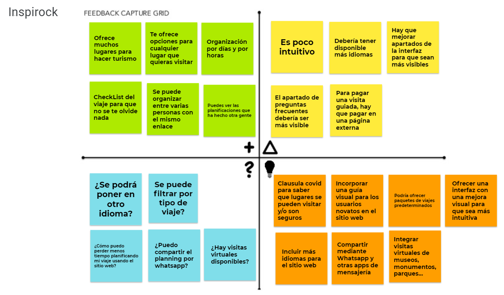
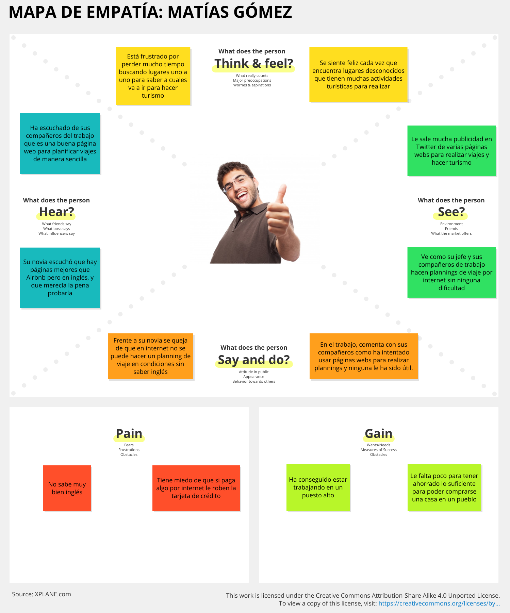
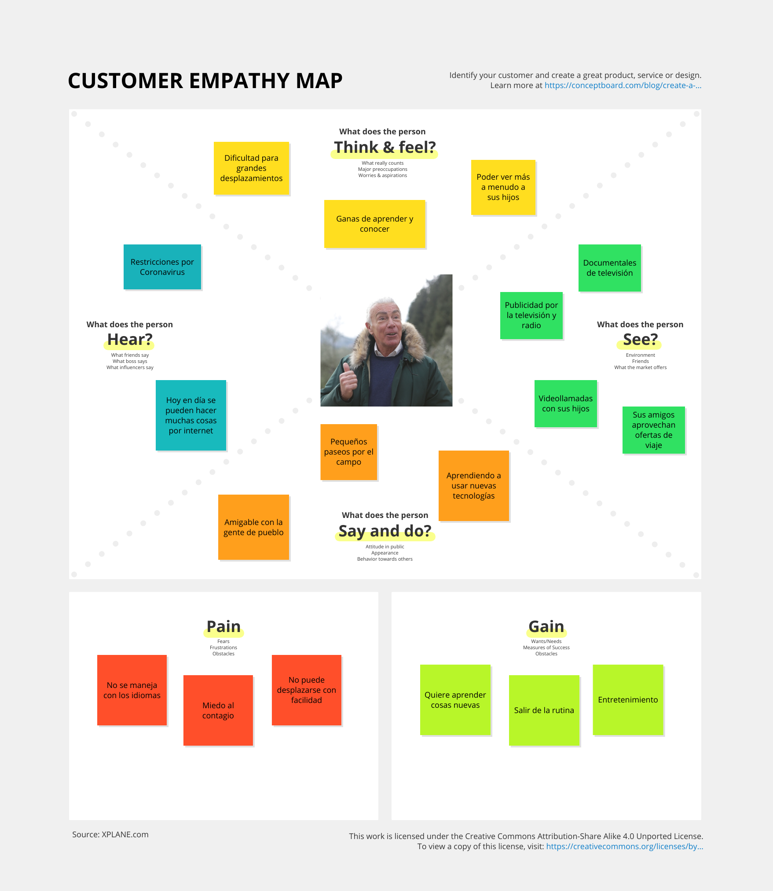
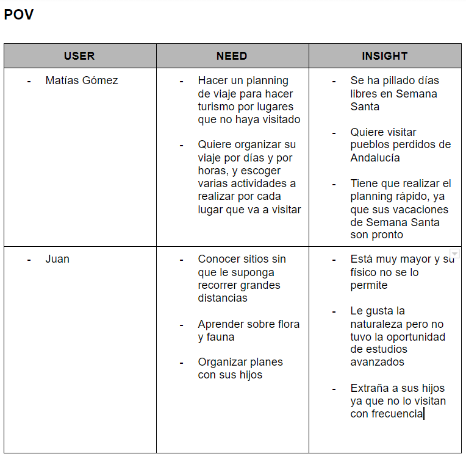
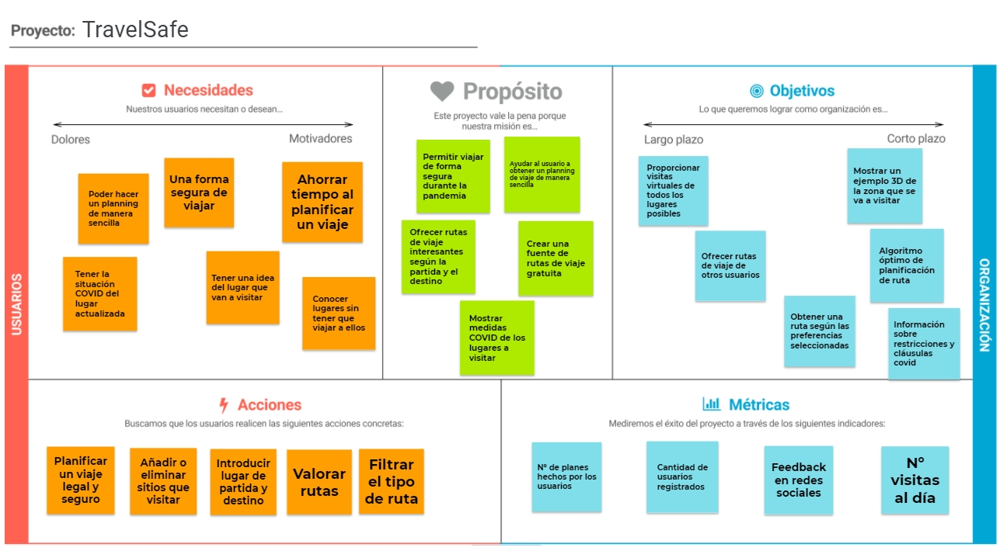
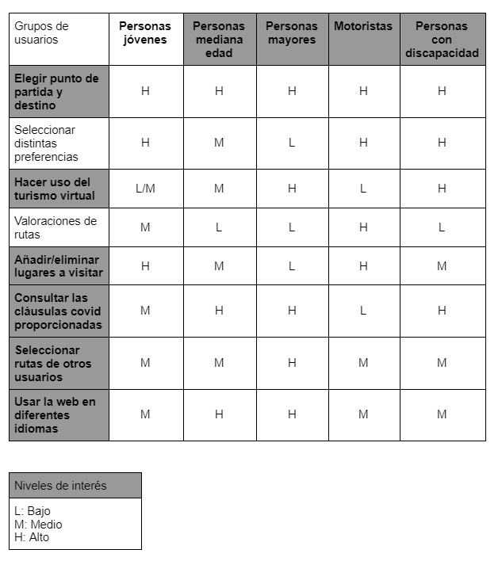
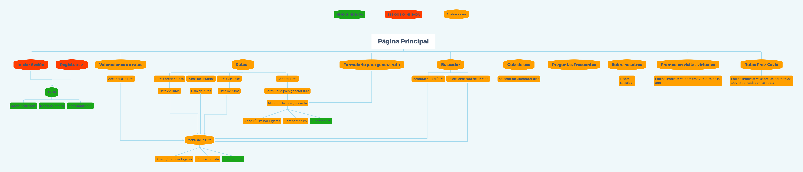
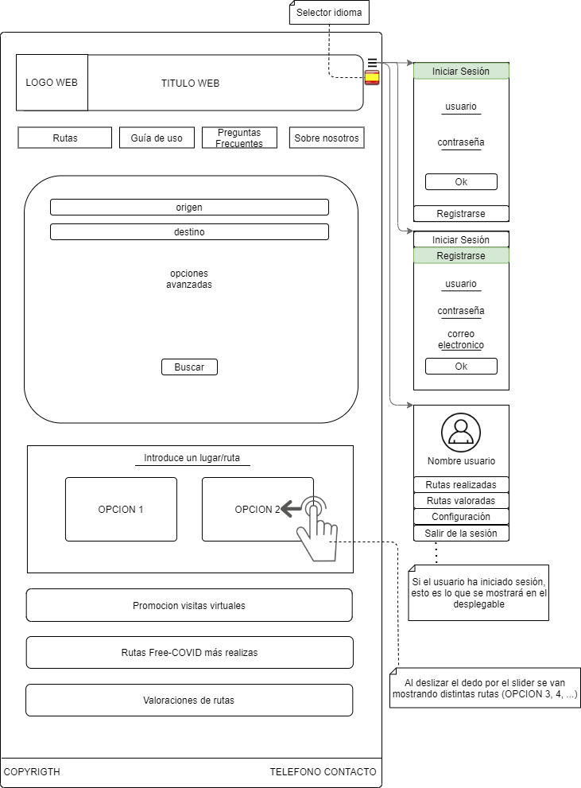
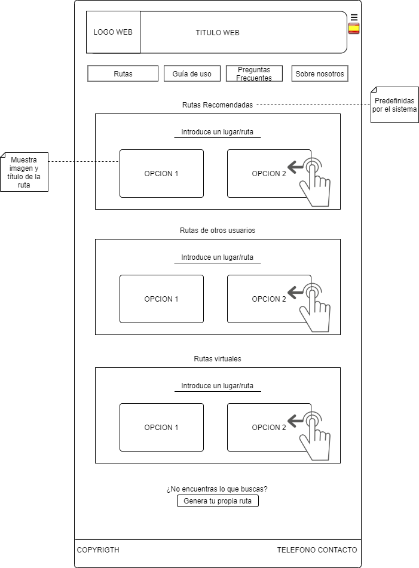
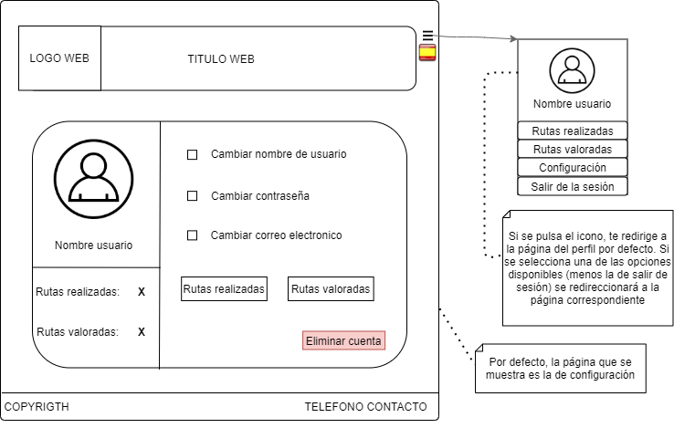

## DIU - Practica2, entregables

### Ideación 

  Para abordar este apartado, pensamos que la manera de obtener la información de la manera más óptima posible sería haciendo uso de la malla receptora de información, para así obtener un análisis completo y sobre todo, directo, de la web Inspirock. El resultado es el siguiente:
* Malla receptora de información 

  Sin embargo, a pesar de obtener una aclaración de todo lo bueno y malo que tiene la web de Inspirock para así poder hacer la nuestra, no nos quedaba claro del todo el por qué de la manera de actuar de los personajes que habíamos ideado para la prácatica 1. Es por esto, que además realizamos el mapa de empatía de ambos personajes, y el point of View:
  
* Mapa de empatía

  Al realizar los mapas de empatía, nos quedó bastante más claro la forma de pensar de los dos usuarios, uno correspondiente a un grupo joven o de mediana edad, y a una persona mayor. Ambos además hacen uso de la web por distintas razones, los cual nos puede ayudar a diseñar nuestra web teniendo en cuenta estos pequeños detalles. Los mapas de empatía son los siguientes:
  

* Point of View 

  En una primera instancia, no estábamos seguros de si realizar el Point of View (al igual que con los mapas de empatía), pero esta parte sobre todo, ya que no nos quedaba claro si realizarla nos iba a ayudar a sacar detalles a tener en cuenta para realizar nuestra web. Aun así, la realizamos, y vimos que había necesidades y situaciones de los usuarios que hacía resaltar puntos flacos de Inspirock, por lo que finalmente nos fue bastante útil. El Point of View obtenido es el siguiente:
  

  Como conclusión del desarrollo de la ideación, creemos que simplemente con el desarrollo de la malla receptora de información nos habría bastado, ya que la parte del mapa de empatía y del Point of View se puede ir "sacando" sobre la marcha a la hora de plantear la web. Aun así, eso no quita que al haber desarrollado estas dos últimas partes no nos hayan servido de nada, al contrario, nos han quitado duda y aclarado la manera de pensar que podrían tener lo usuarios con respecto a webs utilizadas para planificar viajes. 

### PROPUESTA DE VALOR

  Para desarrollar adecuadamente la propuesta de valor de nuestra web, vamos a realizar en primer lugar un ScopeCanvas, para tener un análisis bastante claro de los objetivos que buscamos, que es lo que se podrá realizar con la web, y más detalles a tener en cuenta a la hora de plantear la web. El ScopeCanvas obtenido es el siguiente:
  
* ScopeCanvas

  Tras haberlo obtenido, sacamos una descripción más precisa (no por ello completa, puede variar en el futuro algún aspecto de la web planteada) y completa. A continuación, se mostrará la descripción de nuestra web, **TravelSafe**:
  
  TravelSafe será una página web multiplataforma con varios idiomas disponibles, que ayude a planificar viajes a los usuarios, enfocados estos en el turismo dependiendo de la ruta que vayan a tomar y teniendo en cuenta las normativas COVID actuales de las zonas. Hemos visto que la gran mayoría de webs de este estilo tienen como cláusula covid que el lugar puede que no esté disponible por el número de contagios de la zona, pero pocas indican concretamente que el lugar es "COVID-FREE". Es por ello, que lo primero en lo que se centraría nuestra web sería en ayudar a los usuarios a organizar un planning para viaja por lugares de interés turístico, centrandose en la situación de cada uno de estos lugares. Para ello, lo primero que se le pediría al usuario sería el lugar de partida y el destino. La web, calcularía la ruta óptima, y le daría un planning al usuario dependiendo de los lugares más visitados disponibles con clausula covid (la cual se especificaría en cada uno de ellos). La ruta se podría modificar en tiempo real, y la web eliminará/añadirá los lugares de mayor interés turístico por los que se pase. Por supuesto, se incluirán la opción de elegir distintas preferencias para que los lugares turísticos y actividades turísticas mostradas varíen según estos. Adicionalmente, si al usuario le es imposible viajar a su destino turístico deseado, ya sea por restriccciones legales o simplemente por cuestiones personales o de salud, se plantea la implementación de un entorno virtual para poder realizar dichos viajes desde casa. Por medio de imágenes en 360º, el usuario podrá andar por las calles, visitar monumentos, museos y otros lugares de interés.

### TASK ANALYSIS

  Para este apartado, hemos realizado la matriz de tareas/usuarios, ya que nos parecía más útil que la otra opción. Pensamos que con esta matriz podemos obtener una idea de que tareas vamos a tener que desarrollar en primer lugar, cuales son aquellas a las cuales le dedicaremos más tiempo, y sobre todo lo que pensamos que es lo más importante,una idea temprana del uso que le darán a la web varios grupos de usuarios a los que irá enfocada la misma. 
  El otro caso nos pareció que está bien para obtener los pasos que debe realizar un usuario para realizar las taréas a realizar en nuestra web, pero vimos que esto se podría enfocar de manera más general en el Sitemap del siguiente apartado, por lo que decidimos que el desarrollo de la matriz nos sería bastante más útil que el flujo del usuario/tarea.
  
* User Task Matrix 

  A continuación, describiremos brevemente los distintos grupos de usuarios que hemos planteado:
  
* Personas jóvenes: A este grupo pertenecerían las personas entre 18-30 años, los cuales pensamos que no tendrán un interés tan grande en usar la web para hacer una ruta turística, si no para buscar aquellos lugares a los que ir de vacaciones, o de fiesta. 
* Personas de mediana edad: A este grupo pertenecerían las personas entre 30-60 años, siendo aquellos que suponemos que ya si usarían la web para crear una ruta de viaje y hacer turismo por los lugares por los que pasaran.
* Personas mayores:  A este grupo pertenecerían las personas de 60 años en adelante. Pensamos que estos raramente harían uso de la web comparado con los otros dos grupos, al menos para crear rutas, pero teniendo en cuenta varias características de esta como lo de hacer turismo virtual, es un público que nos importa bastante.
* Motoristas: Debido a que la página consiste en crear distintas rutas de viaje, ofreciendo lugares para visitar, pensamos que a grupos de motoristas les podría gustar esta web, ya que podrían obtener rutas para realizar en un fin de semana o un puente, y a su vez hacer un poco de turismo (aunque suponemos que este aspecto lo podrían despreciar).
* Personas con discapacidad: Tenemos que tener en cuenta que nuestra web puede ser usada por todo tipo de usuarios, incluyendo a aquellos que tengan alguna discapacidad. Es por ello que la web tendría más ayudas de las normales, e incluso alguna opción para daltónicos por ejemplo. Es el grupo en el que nos centraríamos en primer lugar al diseñar la web, ya que es un grupo tan amplio que hay que tener en cuenta a todos los que estén dentro de este.

### ARQUITECTURA DE INFORMACIÓN

* Sitemap 

* Labelling

| Término | Significado |
| ------------- | ------------- |
| Rutas | Se muestran distintos apartados: rutas recomendadas, de otros usuarios y virtuales. Además, hay un botón que te redirige a un formulario para generar tu ruta propia |
| Guía de uso | Se explica cómo usar la web mediante videos explicativos |
| Preguntas frecuentes | Sección con una lista de preguntas que más hacen los usuarios |
| Sobre nosotros | Sección con información general de la página web, el objetivo de la misma, información de los creadores y links de las redes sociales de los creadores y la web en si |
| Icono con bandera | Indica el idioma de la app. Al pulsarlo se podrá seleccionar varios idiomas (estos mostrados como banderas también) |
| Iniciar sesión | Inicio de sesión para usuarios registrados |
| Registrarse | Registro para un nuevo usuario |
| Icono de usuario | Permite acceder a la información del usuario (una vez haya iniciado sesión) |
| Buscador | Introduces el destino o nombre de la ruta (si tiene) y te muestra varias opciones de rutas distintas |
| Valoraciones de rutas | Muestra la valoración de varias rutas realizadas por usuarios.  |
| Rutas realizadas | Muestra las rutas realizadas por el usuario |
| Rutas valoradas | Muestra las valoraciones de las rutas realizadas por el usuario |
| Rutas virtuales | Muestra las rutas proporcionadas por la web que pueden realizarse en 3D desde el navegador |
| Genera tu propia ruta | Redirecciona al usuario a un formulario (el mismo de la página inicial) para rellenarlo y generar una ruta óptima a las preferencias de este |
| Configuración | Permite al usuario cambiar el diseño de la web para personas con discapacidad visual, explicaciones auditivas etc |
| Logo Web | Aparece en cada una de las páginas. Si se selecciona, te redirige a la página principal |
| Promoción visitas virtuales | Apartado en el que se hace "publicidad" acerca de una de las características más llamativas de la web, las visitas guiadas en 3D (visitas virtuales), las cuales son visitas en 3D desde el navegador de diferentes rutas disponibles |
| Rutas Free-COVID más realizadas | Apartado en el que se muestran las rutas con mejor valoración de entre todas las que hay, destacando la seguridad de que estos lugares están desinfectados y son seguros |
| Valoraciones de rutas | Apartado en el que se muestran valoraciones sobre varias rutas, ya hayan sido estas desarrolladas por la web o bien desarrolladas por un usuario |
| Telefono contacto | Telefono asociado a la empresa. Usarlo para realizar cualquier pregunta sobre la web |
| Eliminar cuenta | Elimina la cuenta asociada a un usuario y correo electrónico. Solo visible desde el perfil de dicho usuario |

### Prototipo Lo-FI Wireframe 

Los prototipos se nos exigen que sean de la app de nuestra propuesta, ya que es lo que se nos pide, a pesar de que nuestra propuesta se esté basando en páginas webs y no en aplicaciones móviles (APPs). Hemos realizado los bocetos de las páginas que consideramos que serán visitadas frecuentemente por los usuarios:

* Pagina Inicio

* Rutas

* Perfil

### Conclusiones  

Como conclusion de esta práctica, creemos que es muy útil a la hora de inicializar lo que sería el desarrollo inicial de nuestra propuesta. Lo que no nos ha gustado tanto, es que ha sido bastante trabajosa en todos sus apartados, consumiendonos bastante tiempo, sobre todo en la parte final de los bocetos Lo-Fi, ya que al principio creíamos que estos se tenían que hacer de la versión web de nuestro proyecto y solamente una página (la página principal) y resultaba que teníamos que realizarla de la versión de la APP, y además hace más de una, por lo cual esta última parte es la que más tiempo nos ha consumido, y pensamos que no tendría que ser así. Otro problema ha sido el del Sitemap, que sinceramente creemos que es un paso facil de realizar después de todo, pero debido a los ejemplos que se nos proporcionan, nos ha costado bastante entender como se realizaba esta parte, aunque finalmente lo conseguimos.
