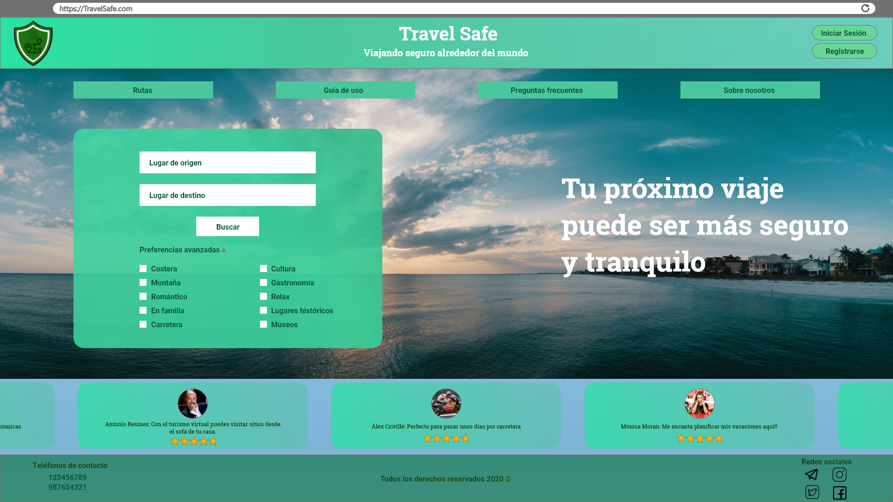
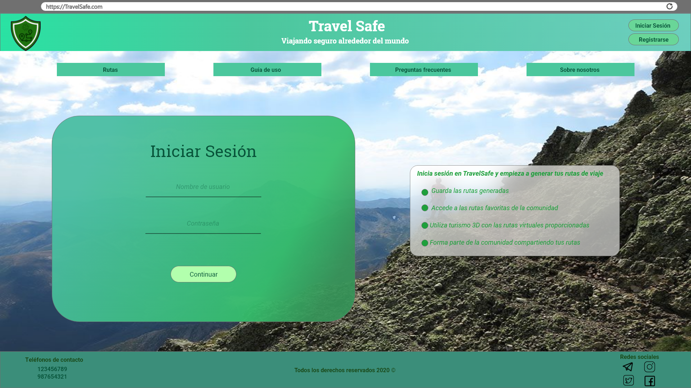
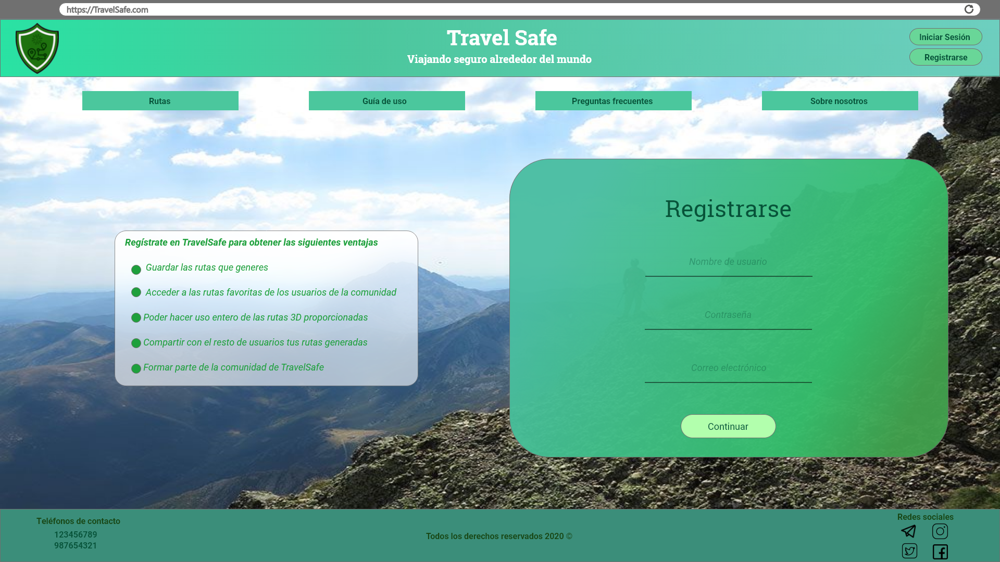
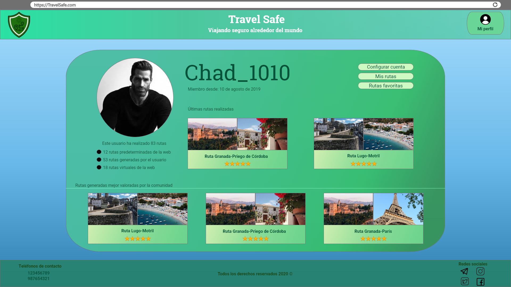

# DIU - Practica 3, entregables

## Moodboard (diseño visual + logotipo)   
El logotipo que hemos diseñado está constituido principalmente por un escudo, simbolizando la seguridad. En este podemos apreciar dos dibujos, uno de una ruta y otro de un virus. La ruta plantea la posibilidad de planificar un viaje, el virus expresa la primera preocupación que tiene una persona al viajar hoy en día. El logo, en vistas generales pretende transmitir la seguridad que nuestra compañía ofrece para la planificación de viajes en la actual época de pandemia.

Hemos decidido usar Roboto y sus variantes (Roboto regular, medium, black...) porque es una fuente con un diseño simple pero elegante, destacando su legibilidad. Según la importancia de los distintos apartados de la página, se empleará un grosor mayor o menor, para hacer más visible la división entre secciones y atraer la vista del usuario a los textos más relevantes.

En cuanto a la paleta de colores, hemos elegido distintas tonalidades de verde, con el propósito de transmitir una sensación de tranquilidad, seguridad y éxito a la hora de planificar un viaje. Para el texto, nos decidimos por el blanco, que ofrece un buen contraste con los tonos verdes sin llegar a desencajar.

Los iconos que usaremos serán los de Ionic, ya que son de código abierto y tienen un estilo minimalista fácil de entender. Además están preparados para ser más o menos gruesos según la visibilidad y la importancia que deseamos que tengan en la página.

## Landing Page

## Mockup: LAYOUT HI-FI

* Página inicio

* Rutas

* Guía de uso

* Iniciar sesión

* Registrarse

* Perfil

* Configuración

* Mis rutas

## Documentación: Publicación del Case Study

(incluye) Valoración del equipo sobre la realización de esta práctica o los problemas surgidos
 
