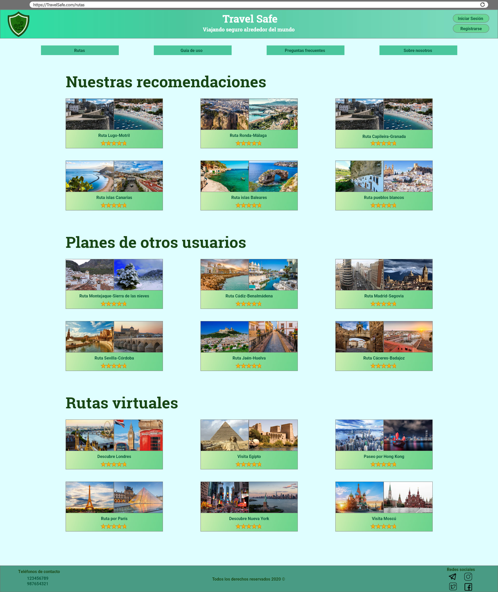
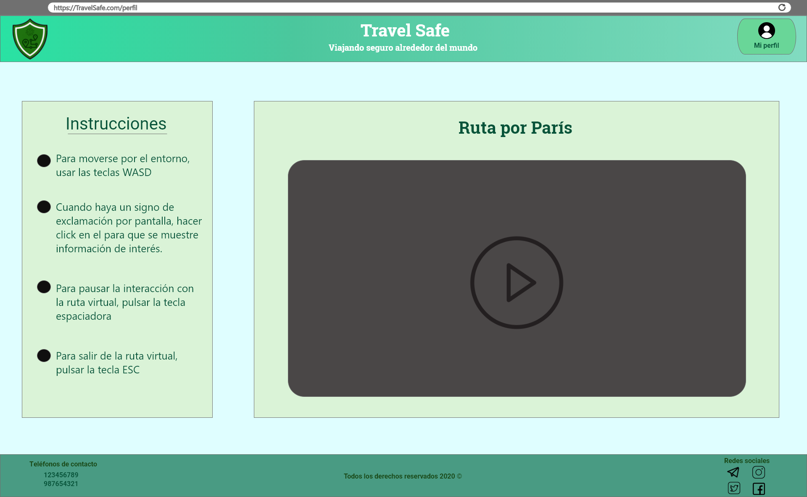
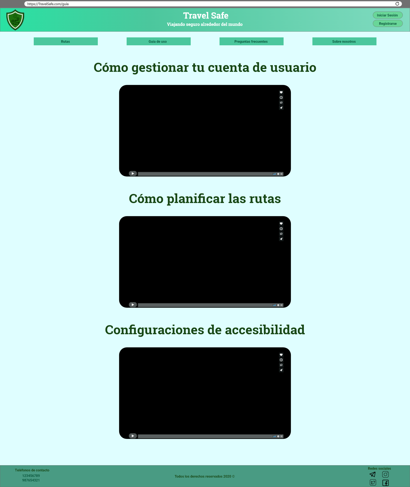
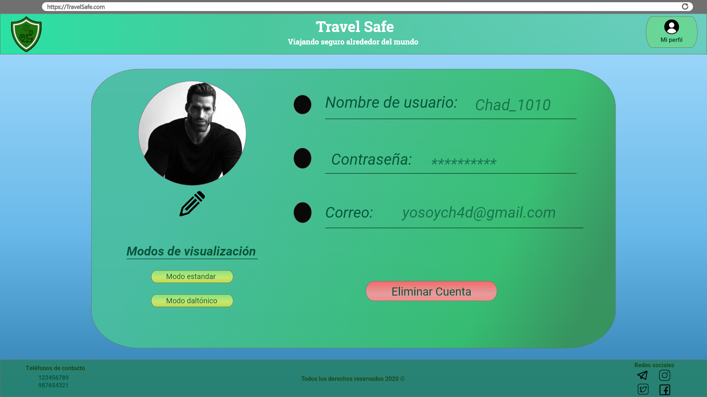

# DIU - Practica 3, entregables

## Moodboard (diseño visual + logotipo)   
El logotipo que hemos diseñado está constituido principalmente por un escudo, simbolizando la seguridad. En este podemos apreciar dos dibujos, uno de una ruta y otro de un virus. La ruta plantea la posibilidad de planificar un viaje, el virus expresa la primera preocupación que tiene una persona al viajar hoy en día. El logo, en vistas generales pretende transmitir la seguridad que nuestra compañía ofrece para la planificación de viajes en la actual época de pandemia.

Hemos decidido usar Roboto y sus variantes (Roboto regular, medium, black...) porque es una fuente con un diseño simple pero elegante, destacando su legibilidad. Según la importancia de los distintos apartados de la página, se empleará un grosor mayor o menor, para hacer más visible la división entre secciones y atraer la vista del usuario a los textos más relevantes.

En cuanto a la paleta de colores, hemos elegido distintas tonalidades de verde, con el propósito de transmitir una sensación de tranquilidad, seguridad y éxito a la hora de planificar un viaje. Para el texto, nos decidimos por el blanco, que ofrece un buen contraste con los tonos verdes sin llegar a desencajar.

Los iconos que usaremos serán los de Ionic, ya que son de código abierto y tienen un estilo minimalista fácil de entender. Además están preparados para ser más o menos gruesos según la visibilidad y la importancia que deseamos que tengan en la página.

## Landing Page

## Guidelines y patrones

Tras mirar varias herramientas de diseño, hemos decidido hacer uso de Adobe Xd. En cuanto a Guidelines, hemos consultado varias. Las que más nos han llamado la atención son aquellas proporcionadas por Google (principalmente en cuanto a colores y tipografía). Para los iconos, hemos decidido usar aquellos más básicos y limpios, que tengan un estilo minimalista. A ser posible, incluiremos aquellos proporcionados por Ionic, al ser muy sencillos y claros.

En cuanto a los patrones, debemos plantear previamente que tareas se van a realizar en nuestra web:
* Principalmente, queremos mostrar información al usuario, normalmente rutas, por lo que deberemos mostrar todos estos elementos de una manera ordenada y, sobre todo clara, para que así el usuario pueda procesar toda la información que se muestre por pantalla.
* Facilitar la visualización de la información. Si por ejemplo el usuario fuese daltónico, puede habilitar una opción que estaría disponible en la web para cambiar el modo de visionado de la página, para que se adapte según el usuario. Se incluirían más modos dependiendo de las dificultades de visualización.
* Al haber una opción de generar ruta introduciendo datos y seleccionando varios tipos de preferencias, deberemos implementar un formulario.
* En cuanto al uso de las rutas virtuales o rutas 3D, sería deseable que hubiese una especie de ayuda implementada en la misma, por lo que sería útil tener un asistente para ayudar al usuario a realizar la ruta 3D.
* Finalmente, también se desea que las rutas mostradas en el apartado Rutas sean las más destacadas, mostrandose estas de manera aleatoria cada vez que se accede a la web, pero que muestre de las rutas más destacadas de las disponibles en la web. Es por ello, que deberemos implementar una especie de gestor de información para mostrar todos estos elementos destacados

Tras este análisis, hemos decidido hacer uso de los siguientes patrones:
1. Patrón lista
2. Patrón destacado
3. Patrón flujo de información
4. Patrón asistente
5. Patrón preferencias
6. Patrón búsqueda
7. Patrón búsqueda avanzada

## Mockup: LAYOUT HI-FI

* Página inicio

* Rutas

* Ejemplo de ruta virtual "Ruta por París"

* Guía de uso

* Iniciar sesión

* Registrarse

* Perfil

* Configuración

Se puede ver una pequeña "demo" de como se navegaría a través de la web a través del siguiente enlace: https://drive.google.com/file/d/1p9VTYE7XhLLuyN0U_kI8v0nqUGqz8BTJ/view?usp=sharing

Como conclusión de esta parte, queremos recalcar la herramienta utilizada y los problemas que hemos tendio con ella.

Hemos hecho uso de Adobe Xd, la cual presenta muchas herramientas para realizar diseños de aplicaciones y webs. Sin embargo, no nos parece nada fácil de utilizar al principio. Nos ha costado bastante acostumbrarnos a ella, ya que la manera de organizar las cosas a pesar de dar la impresión de ser sencilla, es bastante tosca, ocasionandonos problemas de gestión de los elementos que poníamos. Además, que sea poco intuitiva no nos ha ayudado mucho. Aun así, tras mirar varias alternativas (principalmente Bootstrap) nos decantamos por usar Adobe, ya que aunque tuviesemos problemas, conforme más la usábamos menos problemas teníamos. Por eso concluimos de que podrían indicarse otras alternativas que se sepan que son más intuitivas y fáciles de usar a Adobe, pero que no nos consuman más o el mismo tiempo, ya que hemos perdido más tiempo aprendiendo a usar la aplicación para hacer el Landing Page y el Layout HI-FI, que desarrollandolos.

## Documentación: Publicación del Case Study

(incluye) Valoración del equipo sobre la realización de esta práctica o los problemas surgidos
 
