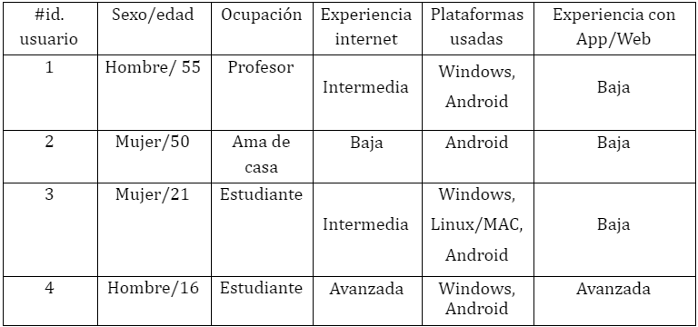
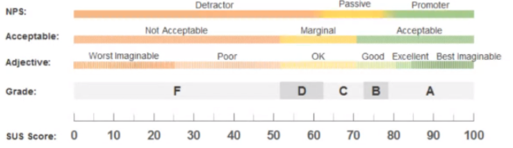

# DIU - Practica 4

## 1. Descripción de los casos A y B

### Caso A: TravelSafe

Descripcion del caso A

### Caso B: Turismo Galera

Descripcion del caso B

## 2. User Testing

Los usuarios 3 y 4 no han tenido ninguna dificultad al realizar los test, ya que al ser más jóvenes, estarán un poco más familiarizados con las apps/webs y el uso de Internet. Sin embargo, nuestros usuarios de mayor edad tienen la barrera de tener poca experienza usando Internet y apps/webs, sumandole a esto que alguna puede tener como idioma predeterminado el inglés, suponiendo una barrera bastante grande a la hora de usar las aplicaciones presentadas.

## 3. Cuestionario SUS

### Caso A: TravelSafe

Poner foto del resultado del SUS, y un enlace al informe de usabilidad con todo

### Caso B: Turismo Galera

Poner foto del resultado del SUS, y un enlace al informe de usabilidad con todo

## 4. Comparación test A/B

## 5. Conclusiones

