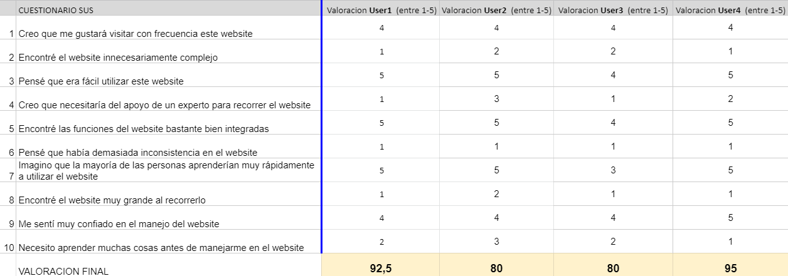
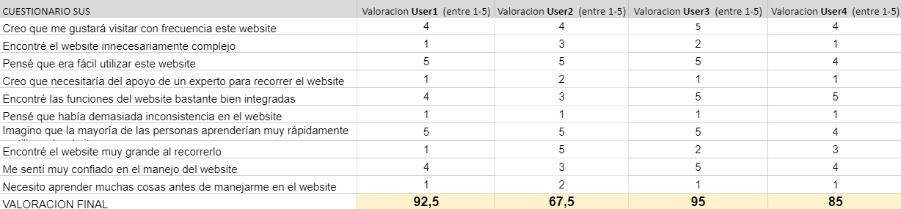

# DIU - Practica 4

## 1. Descripción de los casos A y B

### Caso A: TravelSafe

Con Travel Safe, podrás obtener el planning para un viaje turístico introduciendo el lugar de partida y el de destino (o eligiendo uno ya dado). La web te asignará una ruta predeterminada escogiendo los lugares de más interés (según las preferencias escogidas y las restricciones covid que haya en el momento) para visitar, y dando la opción al usuario de añadir y modificar el planning proporcionado como desee, cambiando el tiempo de visita, añadiendo/quitando los lugares que visitaría, etc. Todos los espacios a visitar tendrán información sobre las cláusulas covid establecidas y las medidas aplicadas. Además, se proporciona al usuario con una demo de lo que sería la visita a los lugares seleccionados virtualmente, sin tener que salir de casa.

### Caso B: Turismo Galera

Aplicación móvil orientada a usuarios extranjeros (sobre todo personas británicas jubiladas) que permite conocer más acerca de la historia, cultura y paisajes del pueblo para decidir si es el lugar idóneo para vivir o visitar.

## 2. User Testing

Los usuarios 3 y 4 no han tenido ninguna dificultad al realizar los test, ya que al ser más jóvenes, estarán un poco más familiarizados con las apps/webs y el uso de Internet. Sin embargo, nuestros usuarios de mayor edad tienen la barrera de tener poca experienza usando Internet y apps/webs, sumandole a esto que alguna puede tener como idioma predeterminado el inglés, suponiendo una barrera bastante grande a la hora de usar las aplicaciones presentadas.

El hecho de que los usuarios sean personas reales favorece y enriquece el resultado de los tests, ya que nos muestra con mucha más precisión el comportamiento que mostrarán determinados grupos de usuarios al usar el sitio web/aplicación móvil.

## 3. Cuestionario SUS

### Caso A: TravelSafe

### Caso B: Turismo Galera

Se puede obtener más información de los test accediendo a los **informes de usabilidad** del [**caso A**](usabilidad_a.pdf) y [**caso B**](usabilidad_b.pdf) 

## 4. Comparación test A/B

Para realizar la comparación de ambos test, haremos uso de la nota obtenida por parte de los usuairos de los cuestionarios SUS. Esta nota se refleja en la escala SUS mostrada en la siguiente imagen.

En general, ambas propuestas han superado el test sin dificultad. En la app Turismo Galera hay una nota que es baja si la comparamos con el resto, pero es entendible, ya que la persona que ha realizado el test no tiene mucha experiencia usando apps. Esto no supone una nota negativa en sí conforme a al test de la app, pero si lo comparamos con el test realizado a TravelSafe, podemos sacar como conclusión que frente a usuarios menos experimentados, Turismo Galera presenta mayor dificultad a la hora de utilizar la app frente a TravelSafe. Aun así, todos los test son positivos y nos sirven para darnos cuenta de que la web/app cumpliría con un estandar bastante alto siendo excelentes para la gran mayoría, siendo recomendada por estos usuarios y reutilizada por los mismos. 

## 5. Conclusiones
Esta práctica ha sido muy interesante porque hemos podido medir el trabajo realizado en las prácticas anteriores en un entorno más "real". Las comparaciones con las prácticas de otros compañeros nos han sido de mucha utilidad, porque hemos podido apreciar los puntos donde tenemos margen de mejora. 

Nos hubiera gustado extender nuestro proyecto, ya no solo en esta práctica sino en todas las demás, pero debido al tiempo que disponíamos no ha sido posible. Hemos podido ver como otros compañeros han logrado un diseño mucho más estético que el que nosotros conseguimos, incluso en ocasiones en el que el grupo estaba compuesto únicamente por un integrante. 

