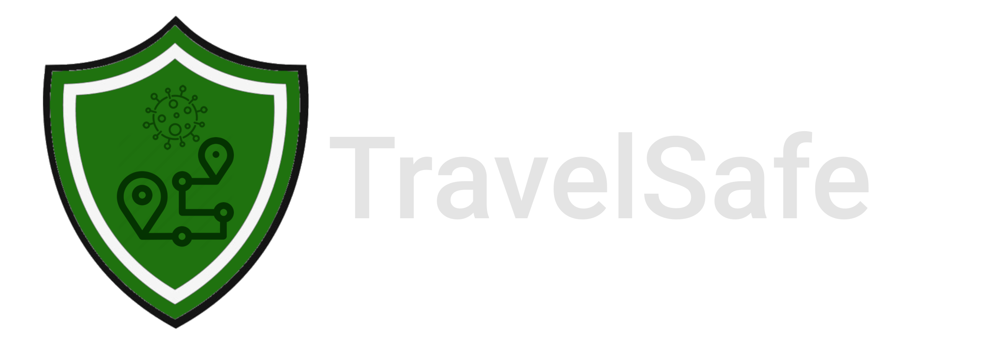
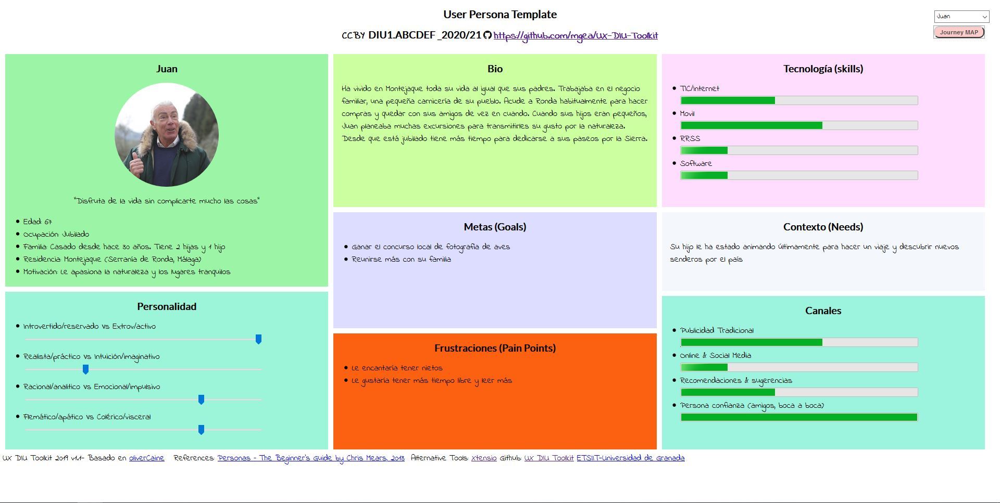
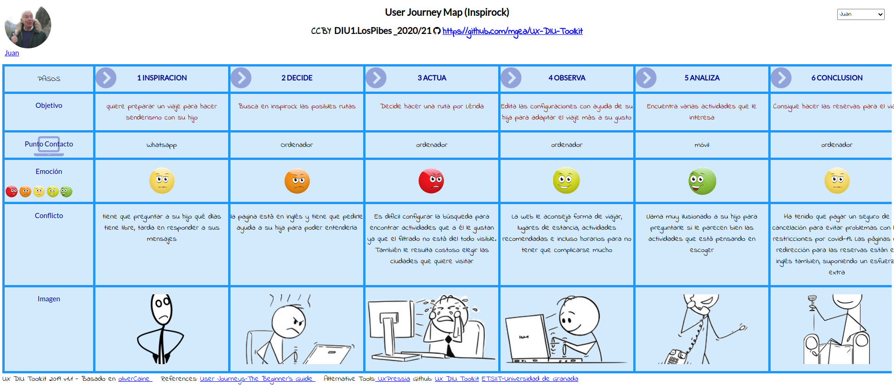
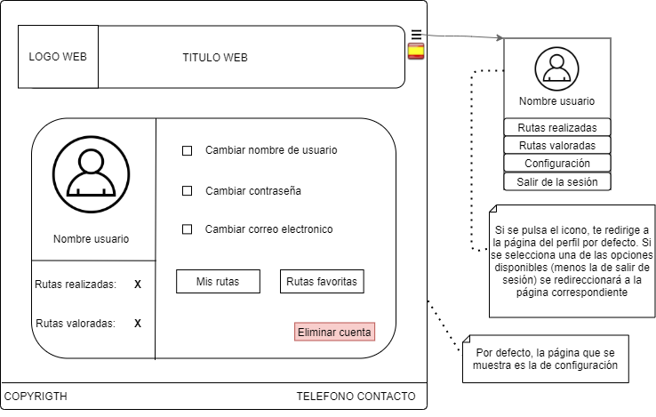

# DIU21
Prácticas Diseño Interfaces de Usuario 2020-21 (Tema: Turismo) 

Grupo: DIU1_LosPibes.  Curso: 2020/21 
Updated: 14/02/2021

Proyecto: TravelSafe

Descripción: Con Travel Safe, podrás obtener el planning para un viaje turístico introduciendo el lugar de partida y el de destino (o eligiendo uno ya dado). La web te asignará una ruta predeterminada escogiendo los lugares de más interés (según las preferencias escogidas y las restricciones covid que haya en el momento) para visitar, y dando la opción al usuario de añadir y modificar el planning proporcionado como desee, cambiando el tiempo de visita, añadiendo/quitando los lugares que visitaría, etc. Todos los espacios a visitar tendrán información sobre las cláusulas covid establecidas y las medidas aplicadas. Además, se proporciona al usuario con una demo de lo que sería la visita a los lugares seleccionados virtualmente, sin tener que salir de casa.  

Logotipo: 

Miembros
 * :bust_in_silhouette:   Agustín Mérida Gutiérrez     :octocat:  [**Agumeri**](https://github.com/Agumeri) 
 * :bust_in_silhouette:  Jorge Zamudio Gutiérrez     :octocat:  [**jorgezg0103**](https://github.com/jorgezg0103)

----- 

# Proceso de Diseño 

## Paso 1. UX Desk Research & Analisis 

 1.a Competitive Analysis
-----

La tabla que hemos realizado para realizar el análisis competitivo es la siguiente: 

La gran mayoría de estas páginas web tienen como finalidad ayudar al usuario a realizar un planning de viaje, con un horario al que están asociadas todas las actividades y lugares que va a realizar y visitar. De entre todas las webs que hemos consultado, la que más nos ha llamado la atención ha sido Inspirock.

Inspirock, al igual que varias de las páginas que hemos seleccionado para compararla (competidores directos como Roadtrippers o indirectos como Tripadvissor), nada más introducir la fecha de nuestro viaje y el lugar al que queremos ir, nos muestra recomendaciones de lo que podríamos visitar cerca del sitio indicado. Sin embargo, una característica que tiene y el resto de páginas no, es que la página por defecto te planifica el viaje por días y horas, siendo la más fiel de todas al objetivo de la página que buscamos, aquella que nos ayude a realizar un planning. Por defecto Inspirock nos pone una ruta a seguir, pero nosotros podemos coger una plantilla vacía, e indicar lo básico: lugar de partida del viaje, y donde acabaremos este. Además de esto, podemos ir introduciendo los lugares que queremos visitar, y se añadirá al calendario que ofrece también la página por defecto. Luego, nosotros podemos decir cuantas horas queremos estar en un lugar predeterminado, o por ejemplo, si se desea hacer rutas de senderismo, poner cuanto tiempo nos deberían consumir. Sin duda, este ha sido el factor determinante que nos ha hecho seleccionar esta web.

A pesar de todo lo positivo, también vemos cosas que se ve a primera vista que han de ser mejoradas: la web no es multi-idioma, solo está en inglés, neerlandés y árabe (aunque la opción de cambiar de idioma está tan escondida, que es como si solo tuviese inglés) y la interfaz no es nada intuitiva (hay que "investigar" para ver como añadir los lugares a visitar y las actividades a realizar en nuestro viaje). Estos serían los aspectos a mejorar en principio. 

 1.b Persona
-----
La primera persona que hemos seleccionado es Matias Gómez, un hombre que adora hacer turismo por cualquier rincón que no haya visitado. Nos ha parecido interesante ya que queríamos tener a alguien que adore viajar y hacer turismo, sin importar el lugar. 

Su ficha es la siguiente:

La segunda persona es Juan, un hombre jubilado que ama la naturaleza y nunca ha salido de su pueblo. Hemos escogido a esta persona para estudiar la interacción que tendría un hombre mayor que no entiende apenas nada de nuevas tecnologías y que nunca ha viajado. 

Su ficha es la siguiente:

 1.c User Journey Map
----

Ahora vamos a ver la experiencia de estos dos usuarios. En ambas vemos comportamientos habituales de las personas a la hora de planificar un viaje haciendo uso de la página web Inspirock para hacer turismo. Veamos ambas experiencias:  

Veamos ambas experiencias: 

 1.d Usability Review
----

- Enlace al documento: [**usability_review**](https://github.com/Agumeri/DIU21/blob/master/P1/Usability-review-pdf.pdf)
- Valoración final: 75
- En general, podemos llegar a la conclusión de que la página Inspirock es muy buena, y logra su cometido a la perfección. Sin embargo, que el idioma esté restringido al inglés (y a los otros dos que hay, pero como si no estuviesen), que la interfaz a pesar de llevar un estilo minimalista y claro no sea para nada intuitiva, y que no ofrezca ayuda para usar la web en sí (un tutorial por ejemplo) son barreras que pueden decidir si el usuario use o no la aplicación, ya sea en ese momento o en un futuro. 

## Paso 2. UX Design  

 2.a Feedback Capture Grid / EMpathy map / POV
----

- Feedback Capture Grid:

- Empaty maps

- 
    
Nuestra propuesta de valor es la siguiente:     

Nosotros hemos planteado una página web multiplataforma con varios idiomas disponibles, que ayude a planificar viajes a los usuarios, enfocados estos en el turismo dependiendo de la ruta que vayan a tomar, teniendo en cuenta las normativas COVID de las zonas. Hemos visto que la gran mayoría de webs tienen como cláusula covid que el lugar puede que no esté disponible por el número de contagios de la zona, pero pocas indican concretamente que el lugar es "COVID-FREE". Es por ello, que lo primero en lo que se centraría nuestra web sería en ayudar a los usuarios a organizar un planning para viaja por lugares de interés turístico, centrandose en la situación de cada uno de estos lugares. Para ello, lo primero que se le pediría al usuario sería el lugar de partida y el destino. La web, calcularía la ruta óptima, y le daría un planning al usuario dependiendo de los lugares más visitados disponibles con clausula covid (la cual se especificaría en cada uno de ellos). La ruta se podría modificar en tiempo real, y la web eliminará/añadirá los lugares de mayor interés turístico por los que se pase. Por supuesto, se incluirán la opción de elegir distintas preferencias para que los lugares turísticos y actividades turísticas mostradas varíen según estos. Adicionalmente, si al usuario le es imposible viajar a su destino turístico deseado, ya sea por restriccciones legales o simplemente por cuestiones personales o de salud, se plantea la implementación de un entorno virtual para poder realizar dichos viajes desde casa. Por medio de imágenes en 360º, el usuario podrá andar por las calles, visitar monumentos, museos y otros lugares de interés.

 2.b ScopeCanvas
----

 2.b Tasks analysis 
-----

- User/Task matrix

 2.c IA: Sitemap + Labelling 
----

- Sitemap

- Labelling

| Término | Significado |
| ------------- | ------------- |
| Rutas | Se muestran distintos apartados: rutas recomendadas, de otros usuarios y virtuales. Además, hay un botón que te redirige a un formulario para generar tu ruta propia |
| Guía de uso | Se explica cómo usar la web mediante videos explicativos |
| Preguntas frecuentes | Sección con una lista de preguntas que más hacen los usuarios |
| Sobre nosotros | Sección con información general de la página web, el objetivo de la misma, información de los creadores y links de las redes sociales de los creadores y la web en si |
| Icono con bandera | Indica el idioma de la app. Al pulsarlo se podrá seleccionar varios idiomas (estos mostrados como banderas también) |
| Iniciar sesión | Inicio de sesión para usuarios registrados |
| Registrarse | Registro para un nuevo usuario |
| Icono de usuario | Permite acceder a la información del usuario (una vez haya iniciado sesión) |
| Buscador | Introduces el destino o nombre de la ruta (si tiene) y te muestra varias opciones de rutas distintas |
| Valoraciones de rutas | Muestra la valoración de varias rutas realizadas por usuarios.  |
| Mis rutas | Muestra las rutas realizadas por el usuario |
| Rutas favoritas | Muestra un listado de las rutas favoritas del usuario |
| Rutas valoradas | Muestra las valoraciones de las rutas realizadas por el usuario |
| Rutas virtuales | Muestra las rutas proporcionadas por la web que pueden realizarse en 3D desde el navegador |
| Genera tu propia ruta | Redirecciona al usuario a un formulario (el mismo de la página inicial) para rellenarlo y generar una ruta óptima a las preferencias de este |
| Configuración | Permite al usuario cambiar el diseño de la web para personas con discapacidad visual, explicaciones auditivas etc |
| Logo Web | Aparece en cada una de las páginas. Si se selecciona, te redirige a la página principal |
| Promoción visitas virtuales | Apartado en el que se hace "publicidad" acerca de una de las características más llamativas de la web, las visitas guiadas en 3D (visitas virtuales), las cuales son visitas en 3D desde el navegador de diferentes rutas disponibles |
| Rutas Free-COVID más realizadas | Apartado en el que se muestran las rutas con mejor valoración de entre todas las que hay, destacando la seguridad de que estos lugares están desinfectados y son seguros |
| Valoraciones de rutas | Apartado en el que se muestran valoraciones sobre varias rutas, ya hayan sido estas desarrolladas por la web o bien desarrolladas por un usuario |
| Telefono contacto | Telefono asociado a la empresa. Usarlo para realizar cualquier pregunta sobre la web |
| Eliminar cuenta | Elimina la cuenta asociada a un usuario y correo electrónico. Solo visible desde el perfil de dicho usuario |

 2.d Wireframes
-----
* Pagina Inicio

* Rutas

* Perfil

## Paso 3. Mi UX-Case Study (diseño)

 3.a Moodboard
-----

>>> Plantear Diseño visual con una guía de estilos visual (moodboard) 
>>> Incluir Logotipo
>>> Si diseña un logotipo, explique la herramienta utilizada y la resolución empleada. ¿Puede usar esta imagen como cabecera de Twitter, por ejemplo, o necesita otra?

  3.b Landing Page
----

>>> Plantear Landing Page 

 3.c Guidelines
----

>>> Estudio de Guidelines y Patrones IU a usar 
>>> Tras documentarse, muestre las deciones tomadas sobre Patrones IU a usar para la fase siguiente de prototipado. 

  3.d Mockup
----

>>> Layout: Mockup / prototipo HTML  (que permita simular tareas con estilo de IU seleccionado)

 3.e ¿My UX-Case Study?
-----

>>> Publicar my Case Study en Github..
>>> Documente y resuma el diseño de su producto en forma de video de 90 segundos aprox

## Paso 4. Evaluación 

 4.a Caso asignado
----

>>> Breve descripción del caso asignado con enlace a  su repositorio Github

 4.b User Testing
----

>>> Seleccione 4 personas ficticias. Exprese las ideas de posibles situaciones conflictivas de esa persona en las propuestas evaluadas. Asigne dos a Caso A y 2 al caso B
 

| Usuarios | Sexo/Edad     | Ocupación   |  Exp.TIC    | Personalidad | Plataforma | TestA/B
| ------------- | -------- | ----------- | ----------- | -----------  | ---------- | ----
| User1's name  | H / 18   | Estudiante  | Media       | Introvertido | Web.       | A 
| User2's name  | H / 18   | Estudiante  | Media       | Timido       | Web        | A 
| User3's name  | M / 35   | Abogado     | Baja        | Emocional    | móvil      | B 
| User4's name  | H / 18   | Estudiante  | Media       | Racional     | Web        | B 

. 4.c Cuestionario SUS
----

>>> Usaremos el **Cuestionario SUS** para valorar la satisfacción de cada usuario con el diseño (A/B) realizado. Para ello usamos la [hoja de cálculo](https://github.com/mgea/DIU19/blob/master/Cuestionario%20SUS%20DIU.xlsx) para calcular resultados sigiendo las pautas para usar la escala SUS e interpretar los resultados
http://usabilitygeek.com/how-to-use-the-system-usability-scale-sus-to-evaluate-the-usability-of-your-website/)
Para más información, consultar aquí sobre la [metodología SUS](https://cui.unige.ch/isi/icle-wiki/_media/ipm:test-suschapt.pdf)

>>> Adjuntar captura de imagen con los resultados + Valoración personal 

 4.d Usability Report
----

>> Añadir report de usabilidad para práctica B (la de los compañeros)

>>> Valoración personal 

## Paso 5. Evaluación de Accesibilidad  

  5.a Accesibility evaluation Report 
----

>>> Indica qué pretendes evaluar (de accesibilidad) sobre qué APP y qué resultados has obtenido 

>>> 5.a) Evaluación de la Accesibilidad (con simuladores o verificación de WACG) 
>>> 5.b) Uso de simuladores de accesibilidad 

>>> (uso de tabla de datos, indicar herramientas usadas) 

>>> 5.c Breve resumen del estudio de accesibilidad (de práctica 1) y puntos fuertes y de mejora de los criterios de accesibilidad de tu diseño propuesto en Práctica 4.

## Conclusión final / Valoración de las prácticas

>>> (90-150 palabras) Opinión del proceso de desarrollo de diseño siguiendo metodología UX y valoración (positiva /negativa) de los resultados obtenidos  

