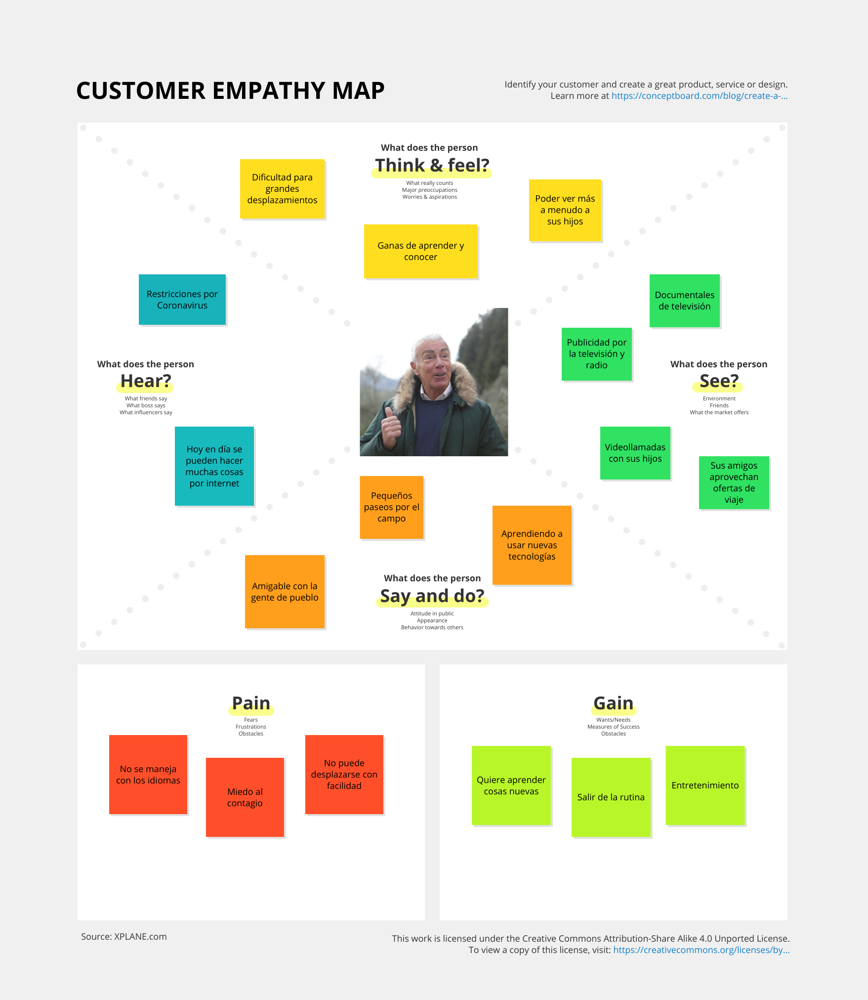
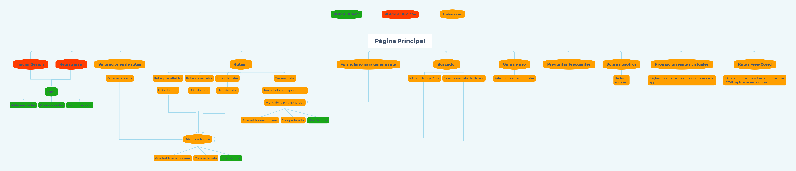
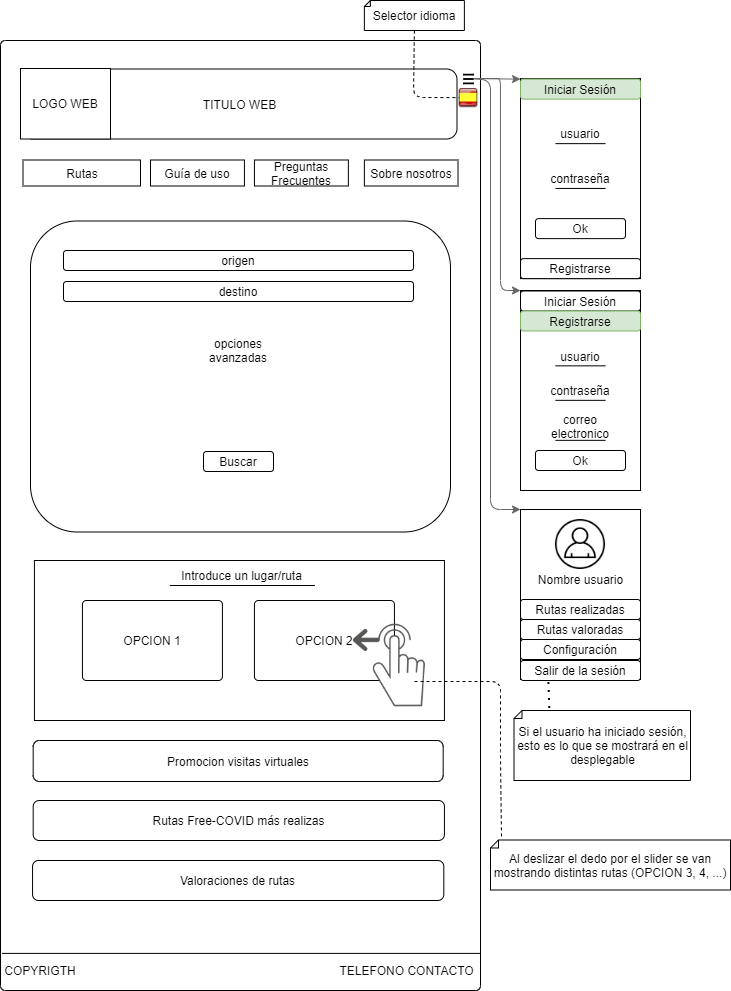
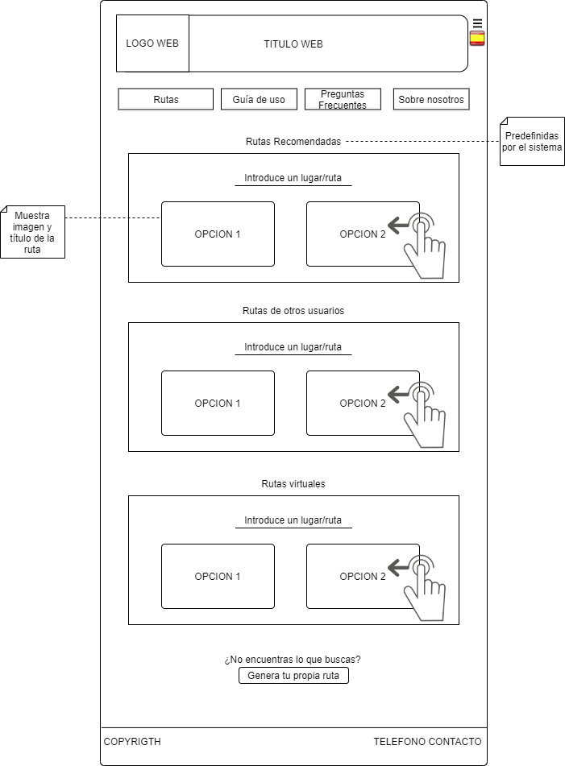

# DIU21
Prácticas Diseño Interfaces de Usuario 2020-21 (Tema: Turismo) 

Grupo: DIU1_LosPibes.  Curso: 2020/21 
Updated: 14/02/2021

Proyecto: TravelSafe

Descripción: Con Travel Safe, podrás obtener el planning para un viaje turístico introduciendo el lugar de partida y el de destino (o eligiendo uno ya dado). La web te asignará una ruta predeterminada escogiendo los lugares de más interés (según las preferencias escogidas y las restricciones covid que haya en el momento) para visitar, y dando la opción al usuario de añadir y modificar el planning proporcionado como desee, cambiando el tiempo de visita, añadiendo/quitando los lugares que visitaría, etc. Todos los espacios a visitar tendrán información sobre las cláusulas covid establecidas y las medidas aplicadas. Además, se proporciona al usuario con una demo de lo que sería la visita a los lugares seleccionados virtualmente, sin tener que salir de casa.  

Logotipo: 

Miembros
 * :bust_in_silhouette:   Agustín Mérida Gutiérrez     :octocat:  [**Agumeri**](https://github.com/Agumeri) 
 * :bust_in_silhouette:  Jorge Zamudio Gutiérrez     :octocat:  [**jorgezg0103**](https://github.com/jorgezg0103)

----- 

# Proceso de Diseño 

## Paso 1. UX Desk Research & Analisis 

 1.a Competitive Analysis
-----

La tabla que hemos realizado para realizar el análisis competitivo es la siguiente: 

La gran mayoría de estas páginas web tienen como finalidad ayudar al usuario a realizar un planning de viaje, con un horario al que están asociadas todas las actividades y lugares que va a realizar y visitar. De entre todas las webs que hemos consultado, la que más nos ha llamado la atención ha sido Inspirock.

Inspirock, al igual que varias de las páginas que hemos seleccionado para compararla (competidores directos como Roadtrippers o indirectos como Tripadvissor), nada más introducir la fecha de nuestro viaje y el lugar al que queremos ir, nos muestra recomendaciones de lo que podríamos visitar cerca del sitio indicado. Sin embargo, una característica que tiene y el resto de páginas no, es que la página por defecto te planifica el viaje por días y horas, siendo la más fiel de todas al objetivo de la página que buscamos, aquella que nos ayude a realizar un planning. Por defecto Inspirock nos pone una ruta a seguir, pero nosotros podemos coger una plantilla vacía, e indicar lo básico: lugar de partida del viaje, y donde acabaremos este. Además de esto, podemos ir introduciendo los lugares que queremos visitar, y se añadirá al calendario que ofrece también la página por defecto. Luego, nosotros podemos decir cuantas horas queremos estar en un lugar predeterminado, o por ejemplo, si se desea hacer rutas de senderismo, poner cuanto tiempo nos deberían consumir. Sin duda, este ha sido el factor determinante que nos ha hecho seleccionar esta web.

A pesar de todo lo positivo, también vemos cosas que se ve a primera vista que han de ser mejoradas: la web no es multi-idioma, solo está en inglés, neerlandés y árabe (aunque la opción de cambiar de idioma está tan escondida, que es como si solo tuviese inglés) y la interfaz no es nada intuitiva (hay que "investigar" para ver como añadir los lugares a visitar y las actividades a realizar en nuestro viaje). Estos serían los aspectos a mejorar en principio. 

 1.b Persona
-----
La primera persona que hemos seleccionado es Matias Gómez, un hombre que adora hacer turismo por cualquier rincón que no haya visitado. Nos ha parecido interesante ya que queríamos tener a alguien que adore viajar y hacer turismo, sin importar el lugar. 

Su ficha es la siguiente:

La segunda persona es Juan, un hombre jubilado que ama la naturaleza y nunca ha salido de su pueblo. Hemos escogido a esta persona para estudiar la interacción que tendría un hombre mayor que no entiende apenas nada de nuevas tecnologías y que nunca ha viajado. 

Su ficha es la siguiente:

 1.c User Journey Map
----

Ahora vamos a ver la experiencia de estos dos usuarios. En ambas vemos comportamientos habituales de las personas a la hora de planificar un viaje haciendo uso de la página web Inspirock para hacer turismo. Veamos ambas experiencias:  

Veamos ambas experiencias: 

 1.d Usability Review
----

- Enlace al documento: [**usability_review**](https://github.com/Agumeri/DIU21/blob/master/P1/Usability-review-pdf.pdf)
- Valoración final: 75
- En general, podemos llegar a la conclusión de que la página Inspirock es muy buena, y logra su cometido a la perfección. Sin embargo, que el idioma esté restringido al inglés (y a los otros dos que hay, pero como si no estuviesen), que la interfaz a pesar de llevar un estilo minimalista y claro no sea para nada intuitiva, y que no ofrezca ayuda para usar la web en sí (un tutorial por ejemplo) son barreras que pueden decidir si el usuario use o no la aplicación, ya sea en ese momento o en un futuro. 

## Paso 2. UX Design  

 2.a Feedback Capture Grid / EMpathy map / POV
----

- Feedback Capture Grid:

- Empaty maps

- 
    
Nuestra propuesta de valor es la siguiente:     

Nosotros hemos planteado una página web multiplataforma con varios idiomas disponibles, que ayude a planificar viajes a los usuarios, enfocados estos en el turismo dependiendo de la ruta que vayan a tomar, teniendo en cuenta las normativas COVID de las zonas. Hemos visto que la gran mayoría de webs tienen como cláusula covid que el lugar puede que no esté disponible por el número de contagios de la zona, pero pocas indican concretamente que el lugar es "COVID-FREE". Es por ello, que lo primero en lo que se centraría nuestra web sería en ayudar a los usuarios a organizar un planning para viaja por lugares de interés turístico, centrandose en la situación de cada uno de estos lugares. Para ello, lo primero que se le pediría al usuario sería el lugar de partida y el destino. La web, calcularía la ruta óptima, y le daría un planning al usuario dependiendo de los lugares más visitados disponibles con clausula covid (la cual se especificaría en cada uno de ellos). La ruta se podría modificar en tiempo real, y la web eliminará/añadirá los lugares de mayor interés turístico por los que se pase. Por supuesto, se incluirán la opción de elegir distintas preferencias para que los lugares turísticos y actividades turísticas mostradas varíen según estos. Adicionalmente, si al usuario le es imposible viajar a su destino turístico deseado, ya sea por restriccciones legales o simplemente por cuestiones personales o de salud, se plantea la implementación de un entorno virtual para poder realizar dichos viajes desde casa. Por medio de imágenes en 360º, el usuario podrá andar por las calles, visitar monumentos, museos y otros lugares de interés.

 2.b ScopeCanvas
----

 2.b Tasks analysis 
-----

- User/Task matrix

 2.c IA: Sitemap + Labelling 
----

- Sitemap

- Labelling

| Término | Significado |
| ------------- | ------------- |
| Rutas | Se muestran distintos apartados: rutas recomendadas, de otros usuarios y virtuales. Además, hay un botón que te redirige a un formulario para generar tu ruta propia |
| Guía de uso | Se explica cómo usar la web mediante videos explicativos |
| Preguntas frecuentes | Sección con una lista de preguntas que más hacen los usuarios |
| Sobre nosotros | Sección con información general de la página web, el objetivo de la misma, información de los creadores y links de las redes sociales de los creadores y la web en si |
| Icono con bandera | Indica el idioma de la app. Al pulsarlo se podrá seleccionar varios idiomas (estos mostrados como banderas también) |
| Iniciar sesión | Inicio de sesión para usuarios registrados |
| Registrarse | Registro para un nuevo usuario |
| Icono de usuario | Permite acceder a la información del usuario (una vez haya iniciado sesión) |
| Buscador | Introduces el destino o nombre de la ruta (si tiene) y te muestra varias opciones de rutas distintas |
| Valoraciones de rutas | Muestra la valoración de varias rutas realizadas por usuarios.  |
| Mis rutas | Muestra las rutas realizadas por el usuario |
| Rutas valoradas | Muestra las valoraciones de las rutas realizadas por el usuario |
| Rutas virtuales | Muestra las rutas proporcionadas por la web que pueden realizarse en 3D desde el navegador |
| Genera tu propia ruta | Redirecciona al usuario a un formulario (el mismo de la página inicial) para rellenarlo y generar una ruta óptima a las preferencias de este |
| Configuración | Permite al usuario cambiar el diseño de la web para personas con discapacidad visual, explicaciones auditivas etc |
| Logo Web | Aparece en cada una de las páginas. Si se selecciona, te redirige a la página principal |
| Promoción visitas virtuales | Apartado en el que se hace "publicidad" acerca de una de las características más llamativas de la web, las visitas guiadas en 3D (visitas virtuales), las cuales son visitas en 3D desde el navegador de diferentes rutas disponibles |
| Rutas Free-COVID más realizadas | Apartado en el que se muestran las rutas con mejor valoración de entre todas las que hay, destacando la seguridad de que estos lugares están desinfectados y son seguros |
| Valoraciones de rutas | Apartado en el que se muestran valoraciones sobre varias rutas, ya hayan sido estas desarrolladas por la web o bien desarrolladas por un usuario |
| Telefono contacto | Telefono asociado a la empresa. Usarlo para realizar cualquier pregunta sobre la web |
| Eliminar cuenta | Elimina la cuenta asociada a un usuario y correo electrónico. Solo visible desde el perfil de dicho usuario |

 2.d Wireframes
-----
* Pagina Inicio

* Rutas

* Perfil

## Paso 3. Mi UX-Case Study (diseño)

 3.a Moodboard
-----

Nuestro objetivo principal era que la página fuese llamativa y que transmitiese la sensación de seguridad al usuario. Es por ello, que vamos a utilizar colores llamativos principalmente, pero colores vivos para atraer la atención del usuario. El logotipo resultante de esto sería el siguiente:

Se ha seleccionado el escudo como símbolo de seguridad, y se han puesto dos dibujos en el representando la página: realizar rutas en los tiempos de pandemia. El logotipo se ha creado haciendo uso del editor GIMP.

La paleta de colores utilizada es la siguiente: 

Como fotos inspiradoras, hemos seleccionado varias que nos han orientado para elegir la paleta de color mostrada. Algunas las hemos utilizado en la web:

  3.b Landing Page
----

La landing page planteada es la siguiente: 

 3.c Guidelines
----

Tras mirar varias herramientas de diseño, hemos decidido hacer uso de Adobe Xd. En cuanto a Guidelines, hemos consultado varias. Las que más nos han llamado la atención son aquellas proporcionadas por Google (principalmente en cuanto a colores y tipografía). Para los iconos, hemos decidido usar aquellos más básicos y limpios, que tengan un estilo minimalista. A ser posible, incluiremos aquellos proporcionados por Ionic, al ser muy sencillos y claros.

En cuanto a los patrones, debemos plantear previamente que tareas se van a realizar en nuestra web:
* Principalmente, queremos mostrar información al usuario, normalmente rutas, por lo que deberemos mostrar todos estos elementos de una manera ordenada y, sobre todo clara, para que así el usuario pueda procesar toda la información que se muestre por pantalla.
* Facilitar la visualización de la información. Si por ejemplo el usuario fuese daltónico, puede habilitar una opción que estaría disponible en la web para cambiar el modo de visionado de la página, para que se adapte según el usuario. Se incluirían más modos dependiendo de las dificultades de visualización.
* Al haber una opción de generar ruta introduciendo datos y seleccionando varios tipos de preferencias, deberemos implementar un formulario.
* En cuanto al uso de las rutas virtuales o rutas 3D, sería deseable que hubiese una especie de ayuda implementada en la misma, por lo que sería útil tener un asistente para ayudar al usuario a realizar la ruta 3D.
* Finalmente, también se desea que las rutas mostradas en el apartado Rutas sean las más destacadas, mostrandose estas de manera aleatoria cada vez que se accede a la web, pero que muestre de las rutas más destacadas de las disponibles en la web. Es por ello, que deberemos implementar una especie de gestor de información para mostrar todos estos elementos destacados

Tras este análisis, hemos decidido hacer uso de los siguientes patrones:
1. Patrón lista
2. Patrón destacado
3. Patrón flujo de información
4. Patrón asistente
5. Patrón preferencias
6. Patrón búsqueda
7. Patrón búsqueda avanzada

  3.d Mockup
----

Para ver los diferentes Layout HI-FI que hemos desarrollado, acceder al siguiente enlace: https://github.com/Agumeri/DIU21/tree/master/P3#mockup-layout-hi-fi

Además se ha realizado una demo de como se navegaría por la web: https://drive.google.com/file/d/1p9VTYE7XhLLuyN0U_kI8v0nqUGqz8BTJ/view?usp=sharing

 3.e Case Study
-----

Vídeo de presentación de nuestro case study: https://drive.google.com/file/d/1zUvTLrDt_FVAQwcZ0LrVU7YaDCqPyMrg/view?usp=sharing

## Paso 4. Evaluación 

 4.a Caso asignado
----

A nuestro grupo se le ha asignado la propuesta del grupo DIU2.JTS, **Turismo Galera**, una aplicación móvil orientada a usuarios extranjeros (sobre todo personas británicas jubiladas) que permite conocer más acerca de la historia, cultura y paisajes del pueblo para decidir si es el lugar idóneo para vivir o visitar. 

 4.b User Testing
----

Los usuarios que van a realizar el test son personas reales. El hecho de que sean personas reales favorece y enriquece el resultado de los test, ya que nos muestra con mucha más precisión el comportamiento que mostrarán determinados grupos de usuarios al usar el sitio web/aplicación móvil. 

. 4.c Cuestionario SUS
----

Podemos sacar de conclusión que la aplicación móvil Turismo Galera supera todos los test con notas bastante altas, pero frente a un usuario con menos experiencia en el uso de Internet y las webs y aplicaciones en general, obtiene una peor nota. Pensamos que esto no es de por si un suspenso, si no que refleja que la app no está pensada para este tipo de personas, lo cual supondría la posible pérdida de los usuarios de este tipo. 

 4.d Usability Report
----

El informe de usabilidad del caso B, **Turismo Galera**, es el siguiente: https://github.com/Agumeri/DIU21/blob/master/P4/usabilidad_b.pdf

Tras realizar este informe de usabilidad, pensamos que la aplicación Turismo Galera está muy bien diseñada, tanto en el diseño, que es muy intuitivo y ayuda bastante a orientarnos en la apps en si, como en el funcionamiento del mismo, siendo claro y conciso, mostrando lo necesario en todo momento. Sin embargo, algo que no vemos tan correcto es el público al que se dirige, siendo un grupo muy específico, lo que ya limitaría el público que haría uso de la app. Además, pensamos que la app tiene mucho potencial, y no se debería centrar sobre todo, tal y como indica, en personas británicas jubiladas, sino en toda clase de público posible. Esto junto a que la demo de la app se presenta como turismo por un lugar específico de Granada cierra bastantes fronteras conforme al uso de la misma. Aun así, esto no significa que la app sea "mala". En cuanto a diseño y organización nos parece bastante mejor que la que hemos planteado nosotros, pero el público y el enfoque al área de turismo que presenta la app no nos parece el adecuado. 

## Conclusión final / Valoración de las prácticas

Como conclusión final del desarrollo que hemos realizado de la práctica planteada para la asignatura de Diseño de Interfaces de Usuario, podemos decir que el proceso previo a lo que sería el desarrollo del código de un proyecto es bastante más interesante de lo que pensábamos en un principio, ya que al tener en cuenta todos los aspectos vistos durante estas 4 prácticas, podemos luego hacernos una mejor idea de como desarrollar la interfaz de la aplicación teniendo en cuenta un estudio de mercado, simulación del tipo de usuarios que usarían la aplicación, distintos enfoques visuales posibles, etc. Todo esto lo vemos como algo positivo, y tenemos pensado usarlo de ahora en adelante en todos los proyectos que hagamos en un futuro.

Sin embargo, también hay partes de las prácticas que tenemos que criticar. Lo primero sería acerca del readme principal, el cual no hemos tenido claro lo que teníamos que poner en él hasta que fue demasiado tarde, perjudicandonos un poco. Otra cosa negativa sería con respecto a la práctica 3 en sí. Al haber planteado una web, nos ha resultado bastante más difícil hacer el diseño al tener que tomar en cuenta muchos aspectos en cada una de las páginas (se puede apreciar que nos faltan detalles que mencionamos en descripciones anteriores). Esto, junto a que la herramienta utilizada, Adobe Xd, con una curva de aprendizaje alta, nos han consumido mucho tiempo, y el resultado que hemos obtenido en esta práctica pensamos que no ha sido el que nosotros habíamos ideado en un principio.

Aun así, hemos valorado positivamente estas prácticas, y en general nos han parecido muy interesantes e interactivas, enseñandonos aspectos del diseño que no se nos habían planteado hasta ahora en lo que llevamos de carrera. 

