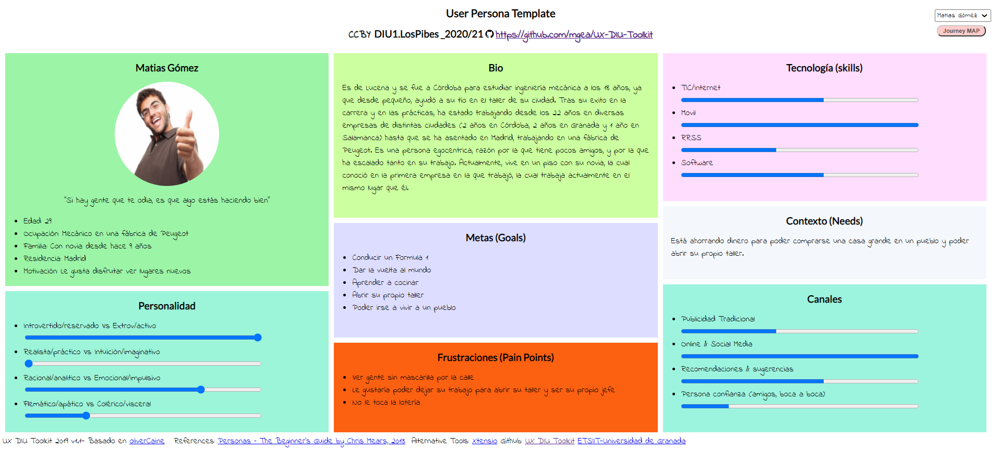
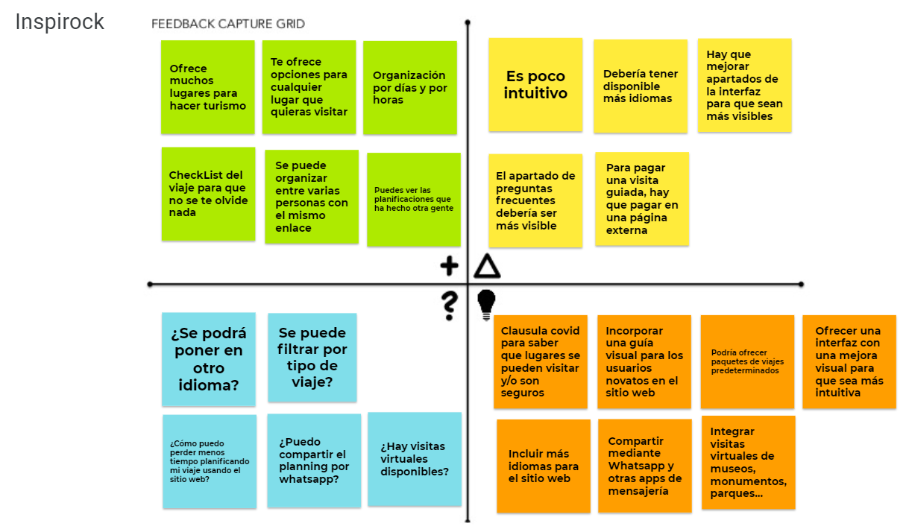

# DIU21
Prácticas Diseño Interfaces de Usuario 2020-21 (Tema: Turismo) 

Grupo: DIU1_LosPibes.  Curso: 2020/21 
Updated: 14/02/2021

Proyecto: Travel Safe

Descripción: Con Travel Safe, podrás obtener el planning para un viaje turístico introduciendo el lugar de partida y el de destino (o eligiendo uno ya dado). La web te asignará una ruta predeterminada escogiendo los lugares de más interés (según las preferencias escogidas) para visitar, y dando la opción al usuario de añadir y modificar el planning proporcionado como desee, cambiando el tiempo de visita, añadiendo/quitando los lugares que visitaría, etc. Además, se proporciona al usuario con una demo de lo que sería la visita a los lugares seleccionados virtualmente, sin tener que salir de casa.  

>>> Describa la idea de su producto en la práctica 2 

Logotipo: 
>>> Opcionalmente si diseña un logotipo para su producto en la práctica 3 pongalo aqui

Miembros
 * :bust_in_silhouette:   Agustín Mérida Gutiérrez     :octocat:  [**Agumeri**](https://github.com/Agumeri) 
 * :bust_in_silhouette:  Jorge Zamudio Gutiérrez     :octocat:  [**jorgezg0103**](https://github.com/jorgezg0103)

----- 

# Proceso de Diseño 

## Paso 1. UX Desk Research & Analisis 

 1.a Competitive Analysis
-----

La tabla que hemos realizado para realizar el análisis competitivo es la siguiente: 

La gran mayoría de estas páginas web tienen como finalidad ayudar al usuario a realizar un planning de viaje, con un horario al que están asociadas todas las actividades y lugares que va a realizar y visitar. De entre todas las webs que hemos consultado, la que más nos ha llamado la atención ha sido Inspirock.

Inspirock, al igual que varias de las páginas que hemos seleccionado para compararla (competidores directos como Roadtrippers o indirectos como Tripadvissor), nada más introducir la fecha de nuestro viaje y el lugar al que queremos ir, nos muestra recomendaciones de lo que podríamos visitar cerca del sitio indicado. Sin embargo, una característica que tiene y el resto de páginas no, es que la página por defecto te planifica el viaje por días y horas, siendo la más fiel de todas al objetivo de la página que buscamos, aquella que nos ayude a realizar un planning. Por defecto Inspirock nos pone una ruta a seguir, pero nosotros podemos coger una plantilla vacía, e indicar lo básico: lugar de partida del viaje, y donde acabaremos este. Además de esto, podemos ir introduciendo los lugares que queremos visitar, y se añadirá al calendario que ofrece también la página por defecto. Luego, nosotros podemos decir cuantas horas queremos estar en un lugar predeterminado, o por ejemplo, si se desea hacer rutas de senderismo, poner cuanto tiempo nos deberían consumir. Sin duda, este ha sido el factor determinante que nos ha hecho seleccionar esta web.

A pesar de todo lo positivo, también vemos cosas que se ve a primera vista que han de ser mejoradas: la web no es multi-idioma, solo está en inglés, neerlandés y árabe (aunque la opción de cambiar de idioma está tan escondida, que es como si solo tuviese inglés) y la interfaz no es nada intuitiva (hay que "investigar" para ver como añadir los lugares a visitar y las actividades a realizar en nuestro viaje). Estos serían los aspectos a mejorar en principio. 

 1.b Persona
-----
La primera persona que hemos seleccionado es Matias Gómez, un hombre que adora hacer turismo por cualquier rincón que no haya visitado. Nos ha parecido interesante ya que queríamos tener a alguien que adore viajar y hacer turismo, sin importar el lugar. 

Su ficha es la siguiente:

La segunda persona es Juan, un hombre jubilado que ama la naturaleza y nunca ha salido de su pueblo. Hemos escogido a esta persona para estudiar la interacción que tendría un hombre mayor que no entiende apenas nada de nuevas tecnologías y que nunca ha viajado. 

Su ficha es la siguiente:

 1.c User Journey Map
----

Ahora vamos a ver la experiencia de estos dos usuarios. En ambas vemos comportamientos habituales de las personas a la hora de planificar un viaje haciendo uso de la página web Inspirock para hacer turismo. Veamos ambas experiencias:  

Veamos ambas experiencias: 

 1.d Usability Review
----

- Enlace al documento: [**usability_review**](https://github.com/Agumeri/DIU21/blob/master/P1/Usability-review-pdf.pdf)
- Valoración final: 75
- En general, podemos llegar a la conclusión de que la página Inspirock es muy buena, y logra su cometido a la perfección. Sin embargo, que el idioma esté restringido al inglés (y a los otros dos que hay, pero como si no estuviesen), que la interfaz a pesar de llevar un estilo minimalista y claro no sea para nada intuitiva, y que no ofrezca ayuda para usar la web en sí (un tutorial por ejemplo) son barreras que pueden decidir si el usuario use o no la aplicación, ya sea en ese momento o en un futuro. 

## Paso 2. UX Design  

 2.a Feedback Capture Grid / EMpathy map / POV
----

- Feedback Capture Grid:

- Empaty maps

    
>>> ¿Que planteas como "propuesta de valor" para un nuevo diseño de aplicación para realizar el planning para un viaje enfocado en el turismo ?
>>> Problema e hipótesis
>>>  Que planteas como "propuesta de valor" para un nuevo diseño de aplicación para economia colaborativa te
>>> (150-200 caracteres)

Nosotros hemos planteado una página web multiplataforma con varios idiomas disponibles, que ayude a planificar viajes a los usuarios, enfocados estos en el turismo dependiendo de la ruta que vayan a tomar, teniendo en cuenta las normativas COVID de las zonas. Hemos visto que la gran mayoría de webs tienen como cláusula covid que el lugar puede que no esté disponible por el número de contagios de la zona, pero pocas indican concretamente que el lugar es "COVID-FREE". Es por ello, que lo primero en lo que se centraría nuestra web sería en ayudar a los usuarios a organizar un planning para viaja por lugares de interés turístico, centrandose en la situación de cada uno de estos lugares. Para ello, lo primero que se le pediría al usuario sería el lugar de partida y el destino. La web, calcularía la ruta óptima, y le daría un planning al usuario dependiendo de los lugares más visitados disponibles con clausula covid (la cual se especificaría en cada uno de ellos). La ruta se podría modificar en tiempo real, y la web eliminará/añadirá los lugares de mayor interés turístico por los que se pase. Por supuesto, se incluirán la opción de elegir distintas preferencias para que los lugares turísticos y actividades turísticas mostradas varíen según estos.

 2.b ScopeCanvas
----
>>> Propuesta de valor 

 2.b Tasks analysis 
-----

>>> Definir "User Map" y "Task Flow" ... 

 2.c IA: Sitemap + Labelling 
----

>>> Identificar términos para diálogo con usuario  

Término | Significado     
| ------------- | -------
  Login¿?  | acceder a plataforma

 2.d Wireframes
-----

>>> Plantear el  diseño del layout para Web/movil (organización y simulación ) 

## Paso 3. Mi UX-Case Study (diseño)

 3.a Moodboard
-----

>>> Plantear Diseño visual con una guía de estilos visual (moodboard) 
>>> Incluir Logotipo
>>> Si diseña un logotipo, explique la herramienta utilizada y la resolución empleada. ¿Puede usar esta imagen como cabecera de Twitter, por ejemplo, o necesita otra?

  3.b Landing Page
----

>>> Plantear Landing Page 

 3.c Guidelines
----

>>> Estudio de Guidelines y Patrones IU a usar 
>>> Tras documentarse, muestre las deciones tomadas sobre Patrones IU a usar para la fase siguiente de prototipado. 

  3.d Mockup
----

>>> Layout: Mockup / prototipo HTML  (que permita simular tareas con estilo de IU seleccionado)

 3.e ¿My UX-Case Study?
-----

>>> Publicar my Case Study en Github..
>>> Documente y resuma el diseño de su producto en forma de video de 90 segundos aprox

## Paso 4. Evaluación 

 4.a Caso asignado
----

>>> Breve descripción del caso asignado con enlace a  su repositorio Github

 4.b User Testing
----

>>> Seleccione 4 personas ficticias. Exprese las ideas de posibles situaciones conflictivas de esa persona en las propuestas evaluadas. Asigne dos a Caso A y 2 al caso B
 

| Usuarios | Sexo/Edad     | Ocupación   |  Exp.TIC    | Personalidad | Plataforma | TestA/B
| ------------- | -------- | ----------- | ----------- | -----------  | ---------- | ----
| User1's name  | H / 18   | Estudiante  | Media       | Introvertido | Web.       | A 
| User2's name  | H / 18   | Estudiante  | Media       | Timido       | Web        | A 
| User3's name  | M / 35   | Abogado     | Baja        | Emocional    | móvil      | B 
| User4's name  | H / 18   | Estudiante  | Media       | Racional     | Web        | B 

. 4.c Cuestionario SUS
----

>>> Usaremos el **Cuestionario SUS** para valorar la satisfacción de cada usuario con el diseño (A/B) realizado. Para ello usamos la [hoja de cálculo](https://github.com/mgea/DIU19/blob/master/Cuestionario%20SUS%20DIU.xlsx) para calcular resultados sigiendo las pautas para usar la escala SUS e interpretar los resultados
http://usabilitygeek.com/how-to-use-the-system-usability-scale-sus-to-evaluate-the-usability-of-your-website/)
Para más información, consultar aquí sobre la [metodología SUS](https://cui.unige.ch/isi/icle-wiki/_media/ipm:test-suschapt.pdf)

>>> Adjuntar captura de imagen con los resultados + Valoración personal 

 4.d Usability Report
----

>> Añadir report de usabilidad para práctica B (la de los compañeros)

>>> Valoración personal 

## Paso 5. Evaluación de Accesibilidad  

  5.a Accesibility evaluation Report 
----

>>> Indica qué pretendes evaluar (de accesibilidad) sobre qué APP y qué resultados has obtenido 

>>> 5.a) Evaluación de la Accesibilidad (con simuladores o verificación de WACG) 
>>> 5.b) Uso de simuladores de accesibilidad 

>>> (uso de tabla de datos, indicar herramientas usadas) 

>>> 5.c Breve resumen del estudio de accesibilidad (de práctica 1) y puntos fuertes y de mejora de los criterios de accesibilidad de tu diseño propuesto en Práctica 4.

## Conclusión final / Valoración de las prácticas

>>> (90-150 palabras) Opinión del proceso de desarrollo de diseño siguiendo metodología UX y valoración (positiva /negativa) de los resultados obtenidos  

