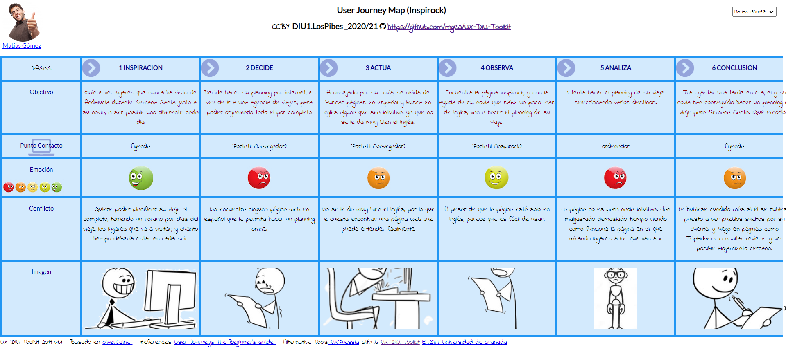

# DIU21
Prácticas Diseño Interfaces de Usuario 2020-21 (Tema: Turismo) 

Grupo: DIU1_LosPibes.  Curso: 2020/21 
Updated: 14/02/2021

Proyecto: 
>>> Decida el nombre corto de su propuesta en la práctica 2 

Descripción: 

>>> Describa la idea de su producto en la práctica 2 

Logotipo: 
>>> Opcionalmente si diseña un logotipo para su producto en la práctica 3 pongalo aqui

Miembros
 * :bust_in_silhouette:   Agustín Mérida Gutiérrez     :octocat:  [**Agumeri**](https://github.com/Agumeri) 
 * :bust_in_silhouette:  Jorge Zamudio Gutiérrez     :octocat:  [**jorgezg0103**](https://github.com/jorgezg0103)

----- 

# Proceso de Diseño 

## Paso 1. UX Desk Research & Analisis 

 1.a Competitive Analysis
-----

La tabla que hemos realizado para realizar el análisis competitivo es la siguiente: 

La gran mayoría de estas páginas web tienen como finalidad ayudar al usuario a realizar un planning de viaje, con un horario al que están asociadas todas las actividades y lugares que va a realizar y visitar. De entre todas las webs que hemos consultado, la que más nos ha llamado la atención ha sido Inspirock.

Inspirock, al igual que varias de las páginas que hemos seleccionado para compararla (competidores directos como Roadtrippers o indirectos como Tripadvissor), nada más introducir la fecha de nuestro viaje y el lugar al que queremos ir, nos muestra recomendaciones de lo que podríamos visitar cerca del sitio indicado. Sin embargo, una característica que tiene y el resto de páginas no, es que la página por defecto te planifica el viaje por días y horas, siendo la más fiel de todas al objetivo de la página que buscamos, aquella que nos ayude a realizar un planning. Por defecto Inspirock nos pone una ruta a seguir, pero nosotros podemos coger una plantilla vacía, e indicar lo básico: lugar de partida del viaje, y donde acabaremos este. Además de esto, podemos ir introduciendo los lugares que queremos visitar, y se añadirá al calendario que ofrece también la página por defecto. Luego, nosotros podemos decir cuantas horas queremos estar en un lugar predeterminado, o por ejemplo, si se desea hacer rutas de senderismo, poner cuanto tiempo nos deberían consumir. Sin duda, este ha sido el factor determinante que nos ha hecho seleccionar esta web.

A pesar de todo lo positivo, también vemos cosas que se ve a primera vista que han de ser mejoradas: la web no es multi-idioma, solo está en inglés y la interfaz no es nada intuitiva (hay que "investigar" para ver como añadir los lugares a visitar y las actividades a realizar en nuestro viaje). Estos serían los aspectos a mejorar en principio. 

 1.b Persona
-----
La primera persona que hemos seleccionado es Matias Gómez, un hombre que adora hacer turismo por cualquier rincón que no haya visitado. Nos ha parecido interesante ya que queríamos tener a alguien que adore viajar y hacer turismo, sin importar el lugar. 

Su ficha es la siguiente:

La segunda persona es Juan, un hombre jubilado que ama la naturaleza y nunca ha salido de su pueblo. Hemos escogido a esta persona para estudiar la interacción que tendría un hombre mayor que no entiende apenas nada de nuevas tecnologías y que nunca ha viajado. 

Su ficha es la siguiente:

 1.c User Journey Map
----

Ahora vamos a ver la experiencia de estos dos usuarios. En ambas vemos comportamientos habituales de las personas a la hora de planificar un viaje para hacer turismo: en el caso de Matias, este no sabe a donde puede ir de todos lo sitios posibles y en el caso de Juan [COMPLETAR]. 

Veamos ambas experiencias: 

 1.d Usability Review
----
>>>  Revisión de usabilidad: (toma los siguientes documentos de referncia y verifica puntos de verificación de  usabilidad
>>>> SE deben incluir claramente los siguientes elementos
>>> - Enlace al documento:  (sube a github el xls/pdf) 
>>> - Valoración final (numérica): 
>>> - Comentario sobre la valoración:  (60-120 caracteres)

## Paso 2. UX Design  

 2.a Feedback Capture Grid / EMpathy map / POV
----

>>> Comenta con un diagrama los aspectos más destacados a modo de conclusion de la práctica anterior,

 Interesante | Críticas     
| ------------- | -------
  Preguntas | Nuevas ideas
  
    
>>> ¿Que planteas como "propuesta de valor" para un nuevo diseño de aplicación para economia colaborativa ?
>>> Problema e hipótesis
>>>  Que planteas como "propuesta de valor" para un nuevo diseño de aplicación para economia colaborativa te
>>> (150-200 caracteres)

 2.b ScopeCanvas
----
>>> Propuesta de valor 

 2.b Tasks analysis 
-----

>>> Definir "User Map" y "Task Flow" ... 

 2.c IA: Sitemap + Labelling 
----

>>> Identificar términos para diálogo con usuario  

Término | Significado     
| ------------- | -------
  Login¿?  | acceder a plataforma

 2.d Wireframes
-----

>>> Plantear el  diseño del layout para Web/movil (organización y simulación ) 

## Paso 3. Mi UX-Case Study (diseño)

 3.a Moodboard
-----

>>> Plantear Diseño visual con una guía de estilos visual (moodboard) 
>>> Incluir Logotipo
>>> Si diseña un logotipo, explique la herramienta utilizada y la resolución empleada. ¿Puede usar esta imagen como cabecera de Twitter, por ejemplo, o necesita otra?

  3.b Landing Page
----

>>> Plantear Landing Page 

 3.c Guidelines
----

>>> Estudio de Guidelines y Patrones IU a usar 
>>> Tras documentarse, muestre las deciones tomadas sobre Patrones IU a usar para la fase siguiente de prototipado. 

  3.d Mockup
----

>>> Layout: Mockup / prototipo HTML  (que permita simular tareas con estilo de IU seleccionado)

 3.e ¿My UX-Case Study?
-----

>>> Publicar my Case Study en Github..
>>> Documente y resuma el diseño de su producto en forma de video de 90 segundos aprox

## Paso 4. Evaluación 

 4.a Caso asignado
----

>>> Breve descripción del caso asignado con enlace a  su repositorio Github

 4.b User Testing
----

>>> Seleccione 4 personas ficticias. Exprese las ideas de posibles situaciones conflictivas de esa persona en las propuestas evaluadas. Asigne dos a Caso A y 2 al caso B
 

| Usuarios | Sexo/Edad     | Ocupación   |  Exp.TIC    | Personalidad | Plataforma | TestA/B
| ------------- | -------- | ----------- | ----------- | -----------  | ---------- | ----
| User1's name  | H / 18   | Estudiante  | Media       | Introvertido | Web.       | A 
| User2's name  | H / 18   | Estudiante  | Media       | Timido       | Web        | A 
| User3's name  | M / 35   | Abogado     | Baja        | Emocional    | móvil      | B 
| User4's name  | H / 18   | Estudiante  | Media       | Racional     | Web        | B 

. 4.c Cuestionario SUS
----

>>> Usaremos el **Cuestionario SUS** para valorar la satisfacción de cada usuario con el diseño (A/B) realizado. Para ello usamos la [hoja de cálculo](https://github.com/mgea/DIU19/blob/master/Cuestionario%20SUS%20DIU.xlsx) para calcular resultados sigiendo las pautas para usar la escala SUS e interpretar los resultados
http://usabilitygeek.com/how-to-use-the-system-usability-scale-sus-to-evaluate-the-usability-of-your-website/)
Para más información, consultar aquí sobre la [metodología SUS](https://cui.unige.ch/isi/icle-wiki/_media/ipm:test-suschapt.pdf)

>>> Adjuntar captura de imagen con los resultados + Valoración personal 

 4.d Usability Report
----

>> Añadir report de usabilidad para práctica B (la de los compañeros)

>>> Valoración personal 

## Paso 5. Evaluación de Accesibilidad  

  5.a Accesibility evaluation Report 
----

>>> Indica qué pretendes evaluar (de accesibilidad) sobre qué APP y qué resultados has obtenido 

>>> 5.a) Evaluación de la Accesibilidad (con simuladores o verificación de WACG) 
>>> 5.b) Uso de simuladores de accesibilidad 

>>> (uso de tabla de datos, indicar herramientas usadas) 

>>> 5.c Breve resumen del estudio de accesibilidad (de práctica 1) y puntos fuertes y de mejora de los criterios de accesibilidad de tu diseño propuesto en Práctica 4.

## Conclusión final / Valoración de las prácticas

>>> (90-150 palabras) Opinión del proceso de desarrollo de diseño siguiendo metodología UX y valoración (positiva /negativa) de los resultados obtenidos  

